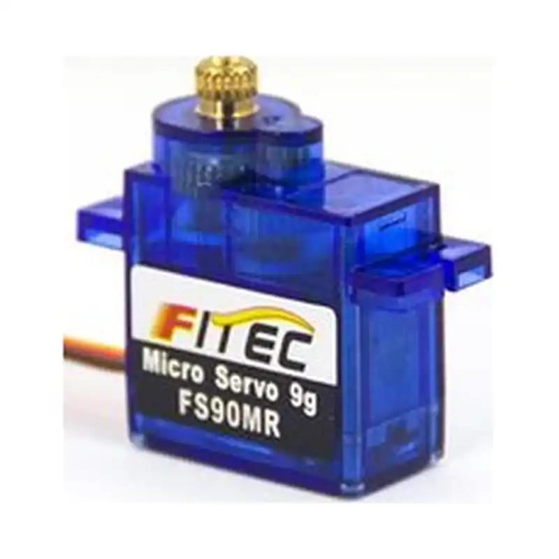
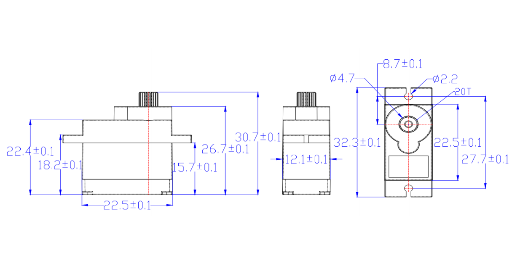

# FS-90MR-C002

{ .ft-model-main-image }

Specifications transcribed from the supplied documentation for this exact model and suffix.

[Back to catalog](../../datasheets/pwm.md){ .md-button }

## Start your integration

| Your task | Start here | What to check |
| --- | --- | --- |
| Write control software | [Software integration](software.md) | Interface, application layer, read-first bring-up and validation record |
| Design a bracket or joint | [Mechanical integration](mechanical.md) | Drawings, CAD, datum, output shaft and cable clearance |
| Collect engineering files | [Resources and status](#resources) | Available files and outstanding information |

## Key specifications

| Parameter | Specification |
| --- | --- |
| --- | --- |
| Input voltage | 3–6 V |
| Stall torque | 2.2 kg·cm@6V |
| No-load speed | 100 RPM/60°@6V |
| Travel / rotation | 360° Continuous rotation（1400→1600 μsec speed control） |
| Control interface | PWM |
| Family | FS |
| Dimensions | 22.5 × 12.1 × 26.7 mm |
| Weight | 12.7 ± 1 g |
| Gears | POM gears |
| Motor | Iron-core motor |
| Document revision | A/0（Official page captured 2026-10-02） |

- [FEETECH model source](https://www.feetech.cn/6v-23kgcm-digital-360-degree-pwm-actuator)

!!! info "Selection note"
    Stall torque is a short-duration limit, not continuous operating torque. Confirm power, shared ground, interface and mechanical clearance before enabling torque.

<!-- official-specs:start -->
## Official model specifications

[FEETECH official product page](https://www.feetechrc.com/6v-23kgcm-digital-360-degree-pwm-actuator) · Checked 2026-10-02. The complete model on the page is FS-90MR-C002.

!!! warning "Claims requiring confirmation"
    The no-load speed unit RPM/60° is ambiguous; no numeric filter value is added.

| Parameter | Manufacturer specification |
| --- | --- |
| Model | FS-90MR-C002 |
| Storage Temperature Range | -30℃～80℃ |
| Operating Temperature Range | -10℃～60℃ |
| Size | A：22.5mm B：12.1mm C: 26.7mm |
| Weight | 12.7± 1g |
| Gear type | POM |
| Limit angle | No limit |
| Bearing | NO |
| Horn gear spline | 20T/4.7mm |
| Gear Ratio | 1/263 |
| Case | PC plastic |
| Connector wire | 25CM |
| Motor | Core Motor |
| Operating Voltage Range | 3V-6V |
| Idle current (atstopped) | 6MA@6V |
| No load speed | 100RPM/60°@6V |
| Runnig current(at no load) | 160mA@6V |
| Peak stall torque | 2.2kg.cm@6V |
| Rated torque | 0.7kg.cm@6V |
| Stall current | 800A@6V |
| Command si gnal | Pulse width modification |
| Amplifier type | Digital comparator |
| Pulse width range | 1400→1600 μsec |
| Stop position | 1500 μ sec |
| Running degree | 360°Continuous rotation (at 1400→1600μsec) |
| Dead band width | ≤90 μ sec |
| Rotating direction | 逆时针 Counterclockwi se (在1500→1600 μ sec) |

Attachment checks: Different model PDF: FS-90MR-C001.pdf

Other files linked by the manufacturer (model applicability unconfirmed):

- [FS-90MR-C001.pdf](https://www.feetechrc.com/Data/feetechrc/upload/file/20260623/6391781987694573169699110.pdf)

{ .ft-model-drawing }

[Open full-size drawing](images/drawing.webp)
<!-- official-specs:end -->

<!-- product-resources:start -->
## Resources and document status {#resources}

Local attachments are included in the model package; PDF specifications link to the manufacturer and are not bundled offline. Missing resources are not yet supplied; family guides do not verify model-specific settings.

| Resource | Status / file | Revision |
| --- | --- | --- |
| Model datasheet | Not supplied | — |
| Connector and pinout | Not supplied | — |
| Model memory table / firmware notes | Not applicable | — |
| 2D mounting drawing | [drawing.webp](images/drawing.webp) | — |
| STEP / 3D model | Not supplied | — |
| Model-tested example | Not supplied | — |
| Raw test data | Not supplied | — |
| Test record and conditions | Not supplied | — |

[Package manifest](manifest.json) · [Request missing resources](#support)

For an offline ZIP with both languages and available attachments, see [product-package export](../../../downloads.md#product-packages).
<!-- product-resources:end -->

## Request resources or report an issue {#support}

Use your existing FEETECH technical-support contact and include the full label/model suffix, firmware version (if known), and the document revision you are using.

- Software: controller/OS, SDK version or commit, adapter/interface, supply voltage, confirmed ID/baud rate (bus models only), minimal reproduction and logs.
- Mechanics: drawing/CAD revision, marked dimensions, required travel, horn/bracket, load and lever arm, duty cycle, and the point of interference.
- Missing files: name the exact item in the resource table (for example, this model's STEP and a dimensioned mounting drawing).

This package currently provides a specification summary and integration checklists. File availability does not imply that your firmware, load case or assembly has been validated.
