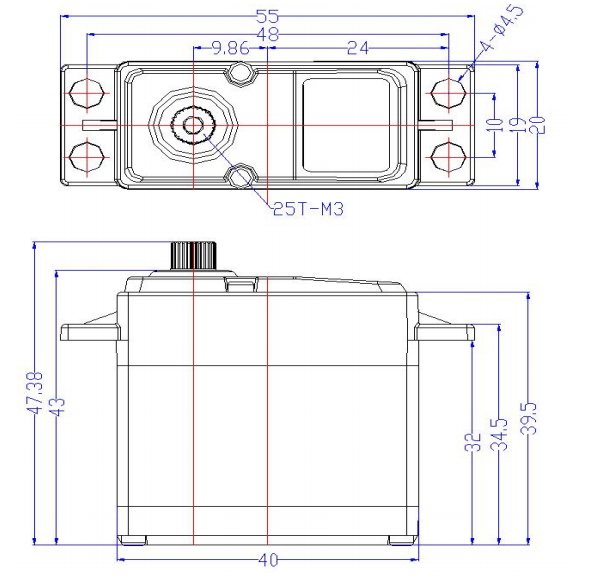

# FT-6325-C001

{ .ft-model-main-image }

Use this page to compare the main specifications of `FT-6325-C001` and plan power, control and mechanical integration.

[Back to PWM catalog](../../datasheets/pwm.md){ .md-button }

## Start your integration

| Your task | Start here | What to check |
| --- | --- | --- |
| Write control software | [Software integration](software.md) | Interface, application layer, read-first bring-up and validation record |
| Design a bracket or joint | [Mechanical integration](mechanical.md) | Drawings, CAD, datum, output shaft and cable clearance |
| Collect engineering files | [Resources and status](#resources) | Available files and outstanding information |

## Key specifications

| Item | Value |
| --- | --- |
| Input voltage | **7.4 V** |
| Stall torque | **25 kg·cm@7.4V** |
| Control interface | `PWM` |
| Product family | `FT` |
| Product model | `FT6325M` |
| Document revision | `A/1` |

!!! info "Selection note"
    Stall torque is a short-duration limit for product comparison, not a continuous operating point. Allow suitable margin for duty cycle, temperature, impact, acceleration and mechanism friction.

## Selection and use

1. Confirm the product label and document revision match this page.
2. Confirm the permitted supply range from this model’s formal documentation before selecting a regulated supply; a single catalog voltage does not establish a range. Size current for simultaneous operation.
3. Match the controller, wiring and PWM signal settings to the exact model documentation.
4. Check mounting space, output shaft, travel and mechanical clearance before enabling torque.

For control signals and first tests, continue with this model’s [software integration](software.md) page. PWM models do not use serial-bus SDKs.

<!-- official-specs:start -->
## Official model specifications

[FEETECH official product page](https://www.feetechrc.com/74v-25-kgcm-digital-360-degree-magnetic-coding-aluminum-medium-shell-steel-gear-iron-core-steering-gear) · Checked 2026-10-02. The complete model on the page is FT-6325-C001.

!!! warning "Claims requiring confirmation"
    case: website table gives plastic, attached PDF gives metal; a new filter value is withheld pending revision confirmation.
    voltageMin: website table gives 6.0, attached PDF gives 4.0; a new filter value is withheld pending revision confirmation.

| Parameter | Manufacturer specification |
| --- | --- |
| Model | FT-6325-C001 |
| Storage Temperature Range | -30℃～80℃ |
| Operating Temperature Range | -20℃～60℃ |
| Size | A：55mm B：20mm C: 43mm |
| Weight | 67土1g |
| Gear type | 钢Steel |
| Limit angle | NO limit |
| Bearing | Ball bearings |
| Horn gear spline | 25T/5.9mm |
| Horn type | Plastic POM |
| Case | PA+A lumi num |
| Connector wire | 30CM |
| Motor | Core Motor |
| Operating Voltage Range | 6V-8.4V |
| Idle current (atstopped) | 6MA@7.4V |
| No load speed | 0.151sec/60°@7.4V |
| Runnig current(at no load) | 120mA@7.4V |
| Peak stall torque | 25kg.cm@7.4V |
| Rated torque | 8.3kg.cm@7.4V |
| Stall current | 3.5A@7.4V |
| Command si gnal | Pulse width modification |
| Amplifier type | Digital compara tor |
| Pulse width range | 500~2500 μ sec |
| Stop position | 1500 μ sec |
| Running degree | 360° （at500→2500 μ sec) |
| Dead band width | ≤4 μ sec |
| Rotating direction | 逆时针 Counterclockwise (在1500→2000 μ sec) |

### Additional facts from the attached datasheet

[Official datasheet](https://www.feetechrc.com/Data/feetechrc/upload/file/20260623/6391782387178133597241826.pdf)

| Parameter | Specification | PDF page |
| --- | --- | --- |
| 角度传感器 Angle Sansor | 类型Type / 12 Bite Magnetic Encoded | 4 |
| 齿轮虚位Back Lash | ≦0.5° | 4 |
| 摇臂虚位 The rocker phantom | 0° | 4 |
| 出力轴螺丝 The rocker screw | M3X6 | 4 |
| 两边角度差 Left&Right Travelling Angledeviation | ≤ 1° | 4 |
| 回中差 Centering Deviation | ≦1° | 4 |
| 信号周期 Signal Period | 20ms | 8 |
| 信号高电平电压 Signal high Voltage | 2V-5V | 8 |
| 信号低电平电压 Signal Low Voltage | 0.0V-0.45V | 8 |

{ .ft-model-drawing }

[Open full-size drawing](images/drawing.webp)
<!-- official-specs:end -->

<!-- product-resources:start -->
## Resources and document status {#resources}

Local attachments are included in the model package; PDF specifications link to the manufacturer and are not bundled offline. Missing resources are not yet supplied; family guides do not verify model-specific settings.

| Resource | Status / file | Revision |
| --- | --- | --- |
| Model datasheet | [View on manufacturer website (online)](https://www.feetechrc.com/Data/feetechrc/upload/file/20260623/6391782387178133597241826.pdf) | A/1 |
| Connector and pinout | Not supplied | — |
| Model memory table / firmware notes | Not applicable | — |
| 2D mounting drawing | [drawing.webp](images/drawing.webp) | — |
| STEP / 3D model | Not supplied | — |
| Model-tested example | Not supplied | — |
| Raw test data | Not supplied | — |
| Test record and conditions | Not supplied | — |

[Package manifest](manifest.json) · [Request missing resources](#support)

For an offline ZIP with both languages and available attachments, see [product-package export](../../../downloads.md#product-packages).
<!-- product-resources:end -->

## Request resources or report an issue {#support}

Use your existing FEETECH technical-support contact and include the full label/model suffix, firmware version (if known), and the document revision you are using.

- Software: controller/OS, SDK version or commit, adapter/interface, supply voltage, confirmed ID/baud rate (bus models only), minimal reproduction and logs.
- Mechanics: drawing/CAD revision, marked dimensions, required travel, horn/bracket, load and lever arm, duty cycle, and the point of interference.
- Missing files: name the exact item in the resource table (for example, this model's STEP and a dimensioned mounting drawing).

This package currently provides a specification summary and integration checklists. File availability does not imply that your firmware, load case or assembly has been validated.
