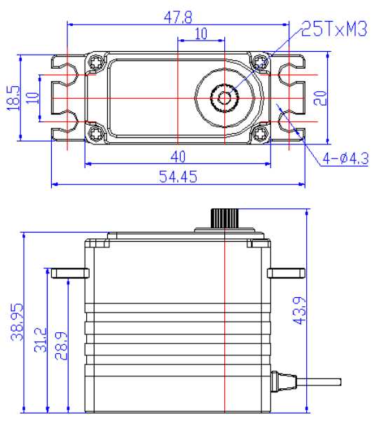

# FT-815B-C001 · Mechanical integration

[Overview and files](main.md) · [Software integration](software.md)

## Start with the engineering files

Check the [resource table](main.md#resources) for this exact model's dimensioned 2D drawing and STEP model. The official dimensioned image is supplied below; check the resource table for STEP availability. The outline dimensions on the overview, if present, are insufficient to release a mounting part for manufacture.

Use a dimensioned, approved drawing for tolerances and interfaces; use STEP for assembly and clearance checks. STL is suitable for visualization or fit prototypes only when its units and scale are confirmed; do not derive manufacturing tolerances from its mesh. Ask the manufacturer to resolve any drawing/CAD discrepancy.

<!-- official-drawing:start -->
## Official dimensioned drawing

{ .ft-model-drawing }

[Full-size drawing](images/drawing.webp) · [Official source](https://www.feetechrc.com/74v-15-kgcm-pwm-digital-180-degree-metal-shell-steel-gear-brushless-actuator)
<!-- official-drawing:end -->

## Check before designing the bracket

| Interface | Confirm from this model's documents |
| --- | --- |
| Envelope and datum | Units, origin, axes, housing size, projections and mounting faces |
| Mounting holes | Hole centers, diameters, threads, usable screw depth, screw length and tightening requirements |
| Output / horn / secondary shaft | Spline or shaft definition, horn compatibility, retention and protrusion |
| Joint zero and travel | Drawing zero, electrical zero, rotation direction, usable travel and hard stops |
| Cable and connector | Exit direction, mating connector, unplugging space, bend allowance and full-travel routing |
| Load and supports | Force direction, lever arm, continuous/peak torque, duty cycle, radial/axial load limits and any external bearing requirements |

Refer to the supplied drawing for dimensions; unspecified fits, tolerances and load limits still require model-specific confirmation. Model-specific horn, screw and bearing recommendations require confirmation.

## Assembly verification sequence

1. Record CAD/drawing revision and units. Check key dimensions against the physical sample before detailed bracket design.
2. Align the housing mounting datum and output axis in the assembly; place the horn at a documented reference position.
3. Check the full confirmed travel for housing/horn/bracket interference and cable tension, including assembly tolerances.
4. Confirm screw engagement, tool access and service access without bottoming screws or loading the case incorrectly.
5. Verify control direction and zero unloaded using the [software workflow](software.md), then attach the mechanism and expand motion gradually within verified limits.

## Load evaluation and handoff

Stall torque is not a continuous rating. Record the actual force direction, lever arm, acceleration, duty cycle, temperature and impact conditions. A single torque-test curve does not establish continuous, radial or axial load capacity.

Deliver the assembly revision, drawing/CAD revisions, horn/bracket part IDs, installed zero, allowed travel and marked clearance screenshots to the control developer. Return any unresolved geometry or loading questions through [technical support](main.md#support).
