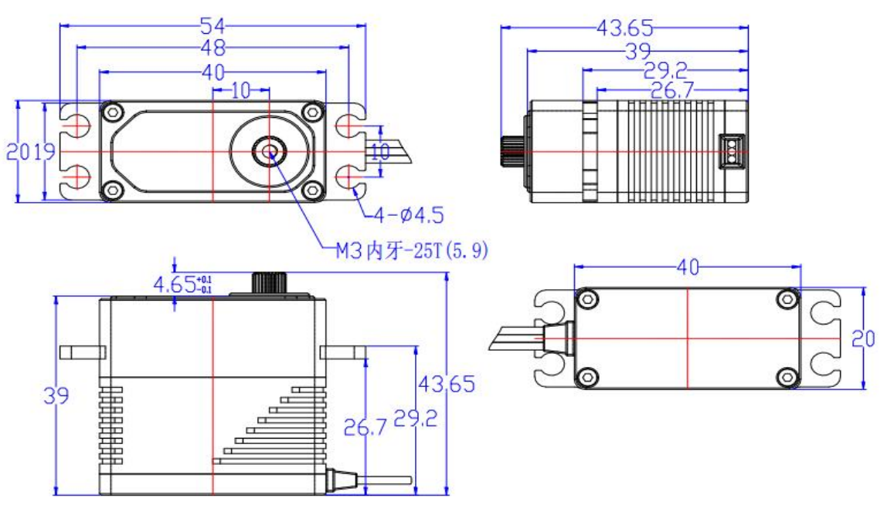

# FU-8830-C001

{ .ft-model-main-image }

Specifications transcribed from the supplied documentation for this exact model and suffix.

[Back to catalog](../../datasheets/fu.md){ .md-button }

## Start your integration

| Your task | Start here | What to check |
| --- | --- | --- |
| Write control software | [Software integration](software.md) | Interface, application layer, read-first bring-up and validation record |
| Design a bracket or joint | [Mechanical integration](mechanical.md) | Drawings, CAD, datum, output shaft and cable clearance |
| Collect engineering files | [Resources and status](#resources) | Available files and outstanding information |

## Key specifications

| Parameter | Specification |
| --- | --- |
| --- | --- |
| Input voltage | 6–8.4 V |
| Stall torque | 34.5 kg·cm@7.4V |
| Rated torque | 11.5 kg·cm@7.4V |
| No-load speed | 0.083 s/60°（120 RPM）@7.4V |
| Control interface | CAN bus（UAVCAN） |
| Position control range | 180 ± 5°（500→2500 μs） |
| Neutral pulse width | 1500 μs |
| Deadband | ≤ 4 μs |
| Rotation direction | Counterclockwise（1500→2000 μs） |
| Mechanical stop | None |
| Motor | Brushless motor |
| Gears | Titanium gears，gear ratio 1/241 |
| Output shaft | 25T / 5.9 mm |
| Case | Aluminum alloy |
| Dimensions | 40 × 20 × 39 mm |
| Weight | 86.4 ± 2 g |
| Idle current | 55 mA @7.4V |
| No-load current | 420 mA @7.4V |
| Ingress protection | IP66 |
| Operating temperature | -20 ~ 60 ℃ |
| Storage temperature | -30 ~ 80 ℃ |

- [FEETECH model source](https://www.feetech.cn/en/503338.html)

!!! info "Selection note"
    Stall torque is a short-duration limit, not continuous operating torque. Confirm power, shared ground, interface and mechanical clearance before enabling torque.

<!-- official-specs:start -->
## Official model specifications

[FEETECH official product page](https://www.feetechrc.com/503338) · Checked 2026-10-02. The complete model on the page is FU-8830-C001.

| Parameter | Manufacturer specification |
| --- | --- |
| Model | FU-8830-C001 |
| Storage Temperature Range | -30℃～80℃ |
| Operating Temperature Range | -20℃～60℃ |
| Size | A：40mm B：20mm C: 39mm |
| Weight | 86.4±2g |
| Gear type | 钛齿 Titanium |
| Limit angle | NO |
| Bearing | 滚珠轴承 Ball bearings |
| Horn gear spline | 25T/5.9mm |
| Gear Ratio | 1/241 |
| Case | Aluminum |
| Connector wire | 30±1CM |
| Motor | Brushless Motor |
| Operating Voltage Range | 6-8.4V |
| Idle current (atstopped) | 55mA@7.4V |
| No load speed | 0.083sec/60°(120RPM)@7.4V |
| Runnig current(at no load) | 420mA@7.4V |
| Peak stall torque | 34.5kg.cm@7.4V |
| Rated torque | 11.5kg.cm@7.4V |
| Command signal | Pulse width modulation |
| Communication Protocol | UAVCAN |
| Control System Type | Digital comparator |
| Pulse width range | 500~2500 μ sec |
| Stop position | 1500 μ sec |
| Running degree | 180±5°(at 500→2500μsec) |
| Dead band width | ≤4 μ sec |
| Rotating direction | 逆时针 Counterclockwise(在1500→2000 μsec) |
| Waterproof performance | IP66 |

Attachment checks: PDF content model not verified: FU-8830-C001规格书-20241017.pdf

Other files linked by the manufacturer (model applicability unconfirmed):

- [FU-8830-C001规格书-20241017.pdf](https://www.feetechrc.com/Data/feetechrc/upload/file/20260617/6391731564544371956530548.pdf)

{ .ft-model-drawing }

[Open full-size drawing](images/drawing.webp)
<!-- official-specs:end -->

<!-- product-resources:start -->
## Resources and document status {#resources}

Local attachments are included in the model package; PDF specifications link to the manufacturer and are not bundled offline. Missing resources are not yet supplied; family guides do not verify model-specific settings.

| Resource | Status / file | Revision |
| --- | --- | --- |
| Model datasheet | Not supplied | — |
| Connector and pinout | Not supplied | — |
| Model memory table / firmware notes | Not supplied | — |
| 2D mounting drawing | [drawing.webp](images/drawing.webp) | — |
| STEP / 3D model | Not supplied | — |
| Model-tested example | Not supplied | — |
| Raw test data | Not supplied | — |
| Test record and conditions | Not supplied | — |

[Package manifest](manifest.json) · [Request missing resources](#support)

For an offline ZIP with both languages and available attachments, see [product-package export](../../../downloads.md#product-packages).
<!-- product-resources:end -->

## Request resources or report an issue {#support}

Use your existing FEETECH technical-support contact and include the full label/model suffix, firmware version (if known), and the document revision you are using.

- Software: controller/OS, SDK version or commit, adapter/interface, supply voltage, confirmed ID/baud rate (bus models only), minimal reproduction and logs.
- Mechanics: drawing/CAD revision, marked dimensions, required travel, horn/bracket, load and lever arm, duty cycle, and the point of interference.
- Missing files: name the exact item in the resource table (for example, this model's STEP and a dimensioned mounting drawing).

This package currently provides a specification summary and integration checklists. File availability does not imply that your firmware, load case or assembly has been validated.
