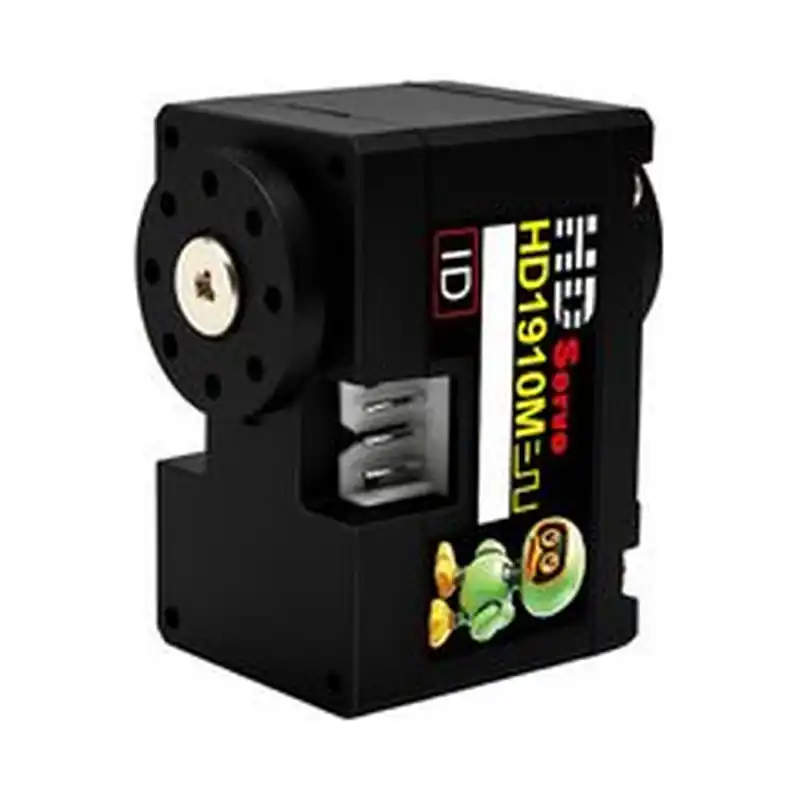
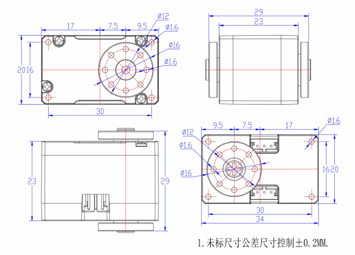

# HD-1910-C001

{ .ft-model-main-image }

`HD-1910-C001` is a compact TTL serial-bus servo for small bipeds and lightweight joints. It combines a coreless motor, metal gears, and a dual-shaft output for Microduck and Open Duck-style robot prototypes.

[Back to the HD catalog](../../datasheets/hd.md){ .md-button }
[Product selector](../../index.md){ .md-button }

## Start your integration

| Your task | Start here | What to check |
| --- | --- | --- |
| Write control software | [Software integration](software.md) | Interface, application layer, read-first bring-up and validation record |
| Design a bracket or joint | [Mechanical integration](mechanical.md) | Drawings, CAD, datum, output shaft and cable clearance |
| Collect engineering files | [Resources and status](#resources) | Available files and outstanding information |

## Key specifications

| Item | Value |
| --- | --- |
| Input voltage | **5–8.4 V** |
| Stall torque | **10 kg·cm@6V** |
| No-load speed | **0.09 s/60° (110 RPM)** |
| Control interface | `TTL serial bus` |
| Motor | Coreless motor |
| Gear train | Metal gears |
| Output structure | Dual shaft |
| Dimensions | 34 × 20 × 23 mm |
| Weight | 22.5 ± 2 g |
| Standby current | 21 mA |

!!! info "Selection note"
    Stall torque is a short-duration limit rather than a continuous operating point. Size power and mechanical margins for simultaneous joint motion, duty cycle, temperature, impact, and peak current.

## Suitable applications

- Microduck and Open Duck-style small biped joints
- Robot legs, necks, and lightweight grippers
- Reinforcement-learning and Sim2Real motion experiments
- University robotics labs and embodied-AI prototypes
- Multi-joint mechanisms with tight space and mass limits

## Integration notes

1. Use a stable 5–8.4 V supply. A fully charged 2S lithium pack is already at the 8.4 V upper limit.
2. Assign unique IDs on a shared bus and size the supply for simultaneous start-up and obstructed motion.
3. Verify the dual-shaft geometry, horn projection, mounting holes, and joint zero before installation. Mechanical parts designed for another servo are rarely direct replacements.
4. Begin with slow, small, unloaded movements before increasing travel.
5. Use the formal HD-1910-C001 memory table and installed firmware for register addresses, modes, and units. Do not copy another family's table.

## Open Duck project note

HD-1910-C001 is intended for lightweight Microduck/Open Duck-style bipeds. A servo change still requires checking mechanics, power, bus protocol, joint zero, controller gains, and the learned policy. It is not a drop-in replacement for another brand's servo or STS3215.

Public project reference: [Pollen Robotics Microduck](https://github.com/pollen-robotics/microduck)

<!-- official-specs:start -->
## Official model specifications

[FEETECH official product page](https://www.feetechrc.com/510257) · Checked 2026-10-02. The complete model on the page is HD-1910-C001.

| Parameter | Manufacturer specification |
| --- | --- |
| Model | HD-1910-C001 |
| Storage Temperature Range | -30℃～80℃ |
| Operating Temperature Range | -20℃～60℃ |
| Temperature Range | 25℃ ±5℃ |
| Humidity Range | 65%±10% |
| Size | A: 34mm B: 20mm C: 23mm |
| Weight | 21±2g |
| Gear type | Metal Gear |
| Limit angle | No limit |
| Bearing | 滚珠轴承 Ball bearings |
| Horn gear spline | 25T/OD4.95mm |
| Gear Ratio | 1/320 |
| Back Lash | ≦0.5° |
| Case | PA66+GF43% |
| Connector wire | 15± 0.5cm |
| Motor | Coreless Motor |
| Rated Input Voltage | 4V-8.4V |
| No load speed | 0.137sec/60 °(73RPM)@4.8V |
| Runnig current(at no load) | ≤160mA@4.8V |
| Peak stall torque | 9kg.cm@4.8V |
| Stall current | 1.2A@4.8V |
| Rated Load | 2.2kg. cm@4.8V |
| Rated current | 500mA@4.8V |
| KT | 7.5kg.cm/A |
| Operating Modes |  Mode 0: Angle servo mode (default mode, absolute position controllable from 0-360 degrees) |
| Multi-Loop Mode | Control of positive and negative 7 turns at the highest accuracy, but the umber of power failure turns is not saved (the resolution can be expanded, and the number of turns can be doubled) |
| Constant force output | Set the output torque value, the servo can maintain this torque (input the target torque value corresponding to address 44, the servo can maintain this torque) |
| Command signal | Digital Packet |
| Protocol Type | Half Duplex Asynchronous Serial Communication |
| ID | 0-253 |
| Communication Speed | 38400bps ~ 1 Mbps |
| Control Algorithm | PID |
| Neutral Position | 2048 |
| Running degree | 360° (when 0~4095) |
| Resolution [deg/pulse] | 0.088°(360°/4096) |
| Rotating Direction | Clockwise(0→4095） |
| Feedback | Load, Position,Speed, Input Voltage，Current,Temperature |

{ .ft-model-drawing }

[Open full-size drawing](images/drawing.webp)
<!-- official-specs:end -->

<!-- product-resources:start -->
## Resources and document status {#resources}

Local attachments are included in the model package; PDF specifications link to the manufacturer and are not bundled offline. Missing resources are not yet supplied; family guides do not verify model-specific settings.

| Resource | Status / file | Revision |
| --- | --- | --- |
| Model datasheet | Not supplied | — |
| Connector and pinout | [interface.webp](images/interface.webp) | — |
| Model memory table / firmware notes | Not supplied | — |
| 2D mounting drawing | [drawing.webp](images/drawing.webp) | — |
| STEP / 3D model | [HD-1910-C001-20260902.stp](images/HD-1910-C001-20260902.stp) | — |
| Model-tested example | Not supplied | — |
| Raw test data | Not supplied | — |
| Test record and conditions | Not supplied | — |

[Package manifest](manifest.json) · [Request missing resources](#support)

For an offline ZIP with both languages and available attachments, see [product-package export](../../../downloads.md#product-packages).
<!-- product-resources:end -->

## Request resources or report an issue {#support}

Use your existing FEETECH technical-support contact and include the full label/model suffix, firmware version (if known), and the document revision you are using.

- Software: controller/OS, SDK version or commit, adapter/interface, supply voltage, confirmed ID/baud rate (bus models only), minimal reproduction and logs.
- Mechanics: drawing/CAD revision, marked dimensions, required travel, horn/bracket, load and lever arm, duty cycle, and the point of interference.
- Missing files: name the exact item in the resource table (for example, this model's STEP and a dimensioned mounting drawing).

This package currently provides a specification summary and integration checklists. File availability does not imply that your firmware, load case or assembly has been validated.
