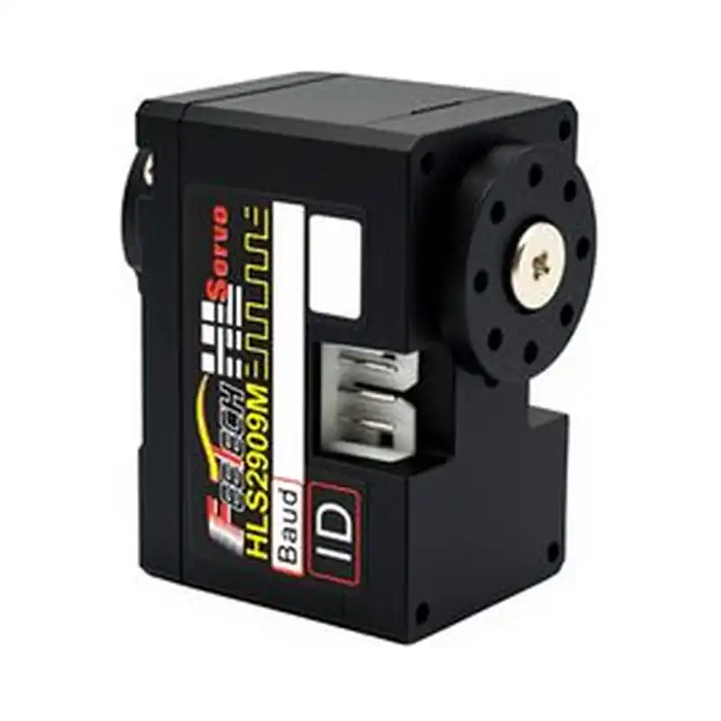
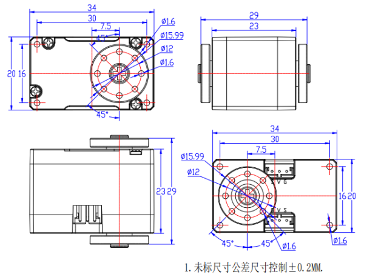

# HL-2909-C001

{ .ft-model-main-image }

Specifications transcribed from the supplied documentation for this exact model and suffix.

[Back to catalog](../../datasheets/hl.md){ .md-button }

## Start your integration

| Your task | Start here | What to check |
| --- | --- | --- |
| Write control software | [Software integration](software.md) | Interface, application layer, read-first bring-up and validation record |
| Design a bracket or joint | [Mechanical integration](mechanical.md) | Drawings, CAD, datum, output shaft and cable clearance |
| Collect engineering files | [Resources and status](#resources) | Available files and outstanding information |

## Key specifications

| Parameter | Specification |
| --- | --- |
| --- | --- |
| Input voltage | 9–14 V |
| Stall torque | 8.9 kg·cm@12V |
| No-load speed | 0.13 s/60°（77 RPM）@12V |
| Travel / rotation | 360°（0~4095，12-bitmagnetic encoder） |
| Control interface | TTL |
| Family | HLS |
| Dimensions | 34 × 20 × 23 mm |
| Weight | 22.5 ± 2 g |
| Gears | Metal gears（plastic case） |
| Motor | Iron-core motor |
| Communication | TTL half-duplex asynchronous serial，ID 0–253，38400bps ~ 1Mbps |
| Shaft structure | Dual-shaft output |
| Document revision | A/0（Official page captured 2026-10-02） |

- [FEETECH model source](https://www.feetech.cn/870282)

!!! info "Selection note"
    Stall torque is a short-duration limit, not continuous operating torque. Confirm power, shared ground, interface and mechanical clearance before enabling torque.

<!-- official-specs:start -->
## Official model specifications

[FEETECH official product page](https://www.feetechrc.com/870282) · Checked 2026-10-02. The complete model on the page is HL-2909-C001.

| Parameter | Manufacturer specification |
| --- | --- |
| Model | HL-2909-C001 |
| Storage Temperature Range | -30℃～80℃ |
| Operating Temperature Range | -10℃～60℃ |
| Temperature Range | 25℃ ±5℃ |
| Humidity Range | 65%±10% |
| Size | A: 34mm B: 20mm C: 23mm |
| Weight | 22.5±2g |
| Gear type | Metal Gear |
| Limit angle | No limit |
| Bearing | 滚珠轴承 Ball bearings |
| Horn gear spline | 25T/OD4.95mm |
| Gear Ratio | 1/320 |
| Back Lash | ≦1° |
| Case | PA+Fiber |
| Connector wire | 15CM/20CM |
| Motor | Core Motor |
| Rated Input Voltage | 9V-14V |
| No load speed | 0.13sec/60°(77RPM)@12V |
| Runnig current(at no load) | 140mA@12V |
| Peak stall torque | 8.9kg.cm@12V |
| Stall current | 0.6A@12V |
| Rated Load | 2.9kg. cm@12V |
| Rated current | 200mA@12V |
| KT | 14.83kg.cm/A |
| Operating Modes | 模式0：角度伺服模式 （默认此模式，0-360度[敏感词]位置可控） Mode 0: Angle servo mode (default mode, absolute position controllable from 0-360 degrees) |
| Multi-Loop Mode | [敏感词]精度下可以正负7圈[敏感词]位置控制，但掉电圈数不保存（扩大分辨率，圈数可翻倍） control of positive and negative 7 turns at the highest accuracy, but the umber of power failure turns is not saved (the resolution can be expanded, and the number of turns can be doubled) |
| Constant force output | 设定输出扭矩值，舵机可保持该扭矩(44号地址输入相对应的目标扭矩值，舵机可保持该扭矩) Set the output torque value, the servo can maintain this torque (input the target torque value corresponding to address 44, the servo can maintain this torque) |
| Command signal | Digital Packet |
| Protocol Type | Half Duplex Asynchronous Serial Communication |
| ID | 0-253 |
| Communication Speed | 38400bps ~ 1 Mbps |
| Control Algorithm | PID |
| Neutral Position | 2048 |
| Running degree | 360° (when 0~4095) |
| Resolution [deg/pulse] | 0.088°(360°/4096) |
| Rotating Direction | Clockwise(0→4095） |
| Feedback | Load（负载）, Position（位置）,Speed（工作速度）, Input Voltage（输入电压），Current（工作电流）,Temperature（工作温度） |

{ .ft-model-drawing }

[Open full-size drawing](images/drawing.webp)
<!-- official-specs:end -->

<!-- product-resources:start -->
## Resources and document status {#resources}

Local attachments are included in the model package; PDF specifications link to the manufacturer and are not bundled offline. Missing resources are not yet supplied; family guides do not verify model-specific settings.

| Resource | Status / file | Revision |
| --- | --- | --- |
| Model datasheet | Not supplied | — |
| Connector and pinout | Not supplied | — |
| Model memory table / firmware notes | Not supplied | — |
| 2D mounting drawing | [drawing.webp](images/drawing.webp) | — |
| STEP / 3D model | Not supplied | — |
| Model-tested example | Not supplied | — |
| Raw test data | Not supplied | — |
| Test record and conditions | Not supplied | — |

[Package manifest](manifest.json) · [Request missing resources](#support)

For an offline ZIP with both languages and available attachments, see [product-package export](../../../downloads.md#product-packages).
<!-- product-resources:end -->

## Request resources or report an issue {#support}

Use your existing FEETECH technical-support contact and include the full label/model suffix, firmware version (if known), and the document revision you are using.

- Software: controller/OS, SDK version or commit, adapter/interface, supply voltage, confirmed ID/baud rate (bus models only), minimal reproduction and logs.
- Mechanics: drawing/CAD revision, marked dimensions, required travel, horn/bracket, load and lever arm, duty cycle, and the point of interference.
- Missing files: name the exact item in the resource table (for example, this model's STEP and a dimensioned mounting drawing).

This package currently provides a specification summary and integration checklists. File availability does not imply that your firmware, load case or assembly has been validated.
