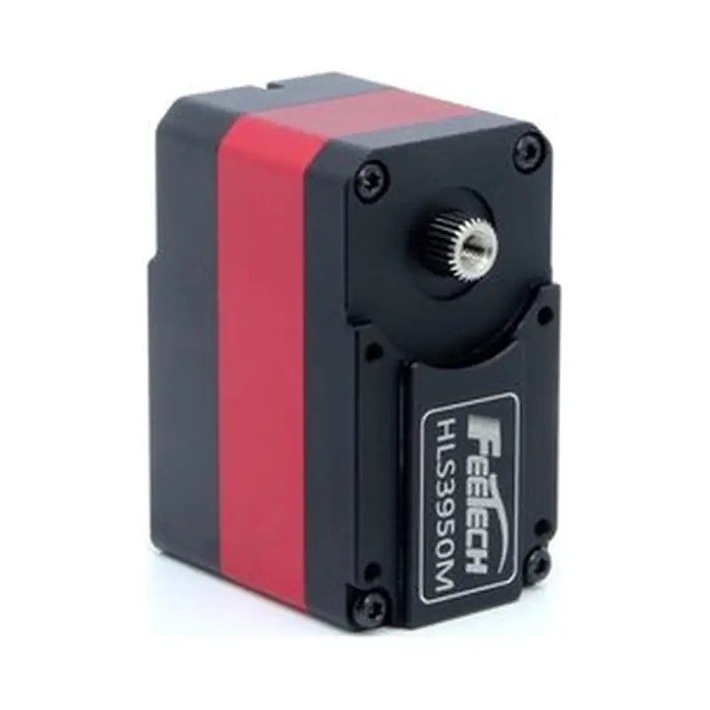
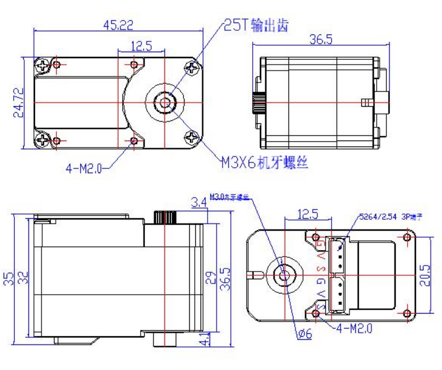

# HL-3950-C001

{ .ft-model-main-image }

Use this page to compare the main specifications of `HL-3950-C001` and plan power, control and mechanical integration.

[Back to HL catalog](../../datasheets/hl.md){ .md-button }

## Start your integration

| Your task | Start here | What to check |
| --- | --- | --- |
| Write control software | [Software integration](software.md) | Interface, application layer, read-first bring-up and validation record |
| Design a bracket or joint | [Mechanical integration](mechanical.md) | Drawings, CAD, datum, output shaft and cable clearance |
| Collect engineering files | [Resources and status](#resources) | Available files and outstanding information |

## Key specifications

| Item | Value |
| --- | --- |
| Input voltage | **9–12.6 V** |
| Stall torque | **50 kg·cm@12V** |
| Control interface | `TTL` |
| Product family | `HLS` |
| Product model | `HLS3950M-C001` |
| Document revision | `A/0` |

## Professional selection specifications

| Parameter | Specification |
| --- | --- |
| No-load speed | 75 rpm@12 V (0.133 s/60°) |
| Position control range | 0–360° |
| Continuous rotation | Supported in motor mode |
| Motor | Coreless (brush type not specified; classification pending) |
| Gear / case | Steel / all-metal aluminum case |
| Shaft configuration | Dual shaft |
| Size A × B × C | 45.22 × 24.72 × 35 mm |
| Longest edge | 45.22 mm |
| Weight | 74.5 ± 1 g |

Source: [FEETECH HL-3950-C001](https://www.feetech.cn/563788.html), checked 2026-10-01. Position control range and continuous rotation are separate; multi-turn counts are not retained after power loss.

<!-- official-specs:start -->
## Official model specifications

[FEETECH official product page](https://www.feetechrc.com/563788) · Checked 2026-10-02. The complete model on the page is HL-3950-C001.

| Parameter | Manufacturer specification |
| --- | --- |
| Model | HL-3950-C001 |
| Storage Temperature Range | -30℃～80℃ |
| Operating Temperature Range | -20℃～60℃ |
| Temperature Range | 25℃ ±5℃ |
| Humidity Range | 65%±10% |
| Size | A：45.22mm B：24.72mm C：35mm |
| Weight | 74.5± 1g |
| Gear type | 钢齿steel Gear |
| Limit angle | No limit |
| Bearing | 滚珠轴承 Ball bearings |
| Horn gear spline | 25T/OD5.9mm |
| Gear Ratio | 1/345 |
| Case | Aluminium |
| Connector wire | 15CM |
| Motor | Coreless Motor |
| Rated Input Voltage | 9V-12.6V |
| No load speed | 0.133sec/60°(75RPM)@12V |
| Runnig current(at no load) | 330mA@12V |
| Peak stall torque | 50kg.cm@12V |
| Stall current | 2.4A@12V |
| Rated Load | 12.5kg. cm@12V |
| Rated current | 600mA@12V |
| KT | 20.8kg. cm/A |
| Terminal resistance | 1.2 Ω |
| Operating Modes | 模式0：角度伺服模式 （默认此模式，0-360度[敏感词]位置可控） Mode 0: Angle servo mode (default mode, absolute position controllable from 0-360 degrees) |
| Constant force output | 设定输出扭矩值，舵机可保持该扭矩(44号地址输入相对应的目标扭矩值，舵机可保持该扭矩) Set the output torque value, the servo can maintain this torque (input the target torque value corresponding to address 44, the servo can maintain this torque) |
| Multi-Loop Mode | [敏感词]精度下可以正负7圈[敏感词]位置控制，但掉电圈数不保存（扩大分辨率，圈数可翻倍） control of positive and negative 7 turns at the highest accuracy, but the umber of power failure turns is not saved (the resolution can be expanded, and the number of turns can be doubled) |
| Command signal | Digital Packet |
| Protocol Type | Half Duplex Asynchronous Serial Communication |
| ID | 0-253(默认出厂值为“ID1”） |
| Communication Speed | 38400bps ~ 1 Mbps（默认出厂波特率为1000000） |
| Control Algorithm | PID（可自定义） |
| Neutral Position | 180°（2048） |
| Running degree | 360° (when 0~4096) |
| Resolution [deg/pulse] | 0.088°(360°/4096) |
| Rotating Direction | Clockwise(0→4096） |
| Feedback | Load（负载）, Position（位置）,Speed（工作速度）, Input Voltage（输入电压），Current（工作电流）,Temperature（工作温度） |

### Additional facts from the attached datasheet

[Official datasheet](https://www.feetechrc.com/Data/feetechrc/upload/file/20260623/6391782924959146461426248.pdf)

| Parameter | Specification | PDF page |
| --- | --- | --- |
| 角度传感器 Angle Sansor | 类型Type / 12Bits Magnetic Coding | 4 |
| 齿轮虚位Back Lash | ≦0.5° | 4 |
| 摇臂虚位The rocker phantom | 0° | 4 |
| 出力轴螺丝 | M3X6 | 4 |
| The rocker screw 马达 Motor | Coreless Motor | 4 |
| 信号高电平电压 Signal high Voltage | 2V-5V | 8 |
| 信号低电平电压 Signal Low Voltage | 0.0V-0.45V | 8 |

{ .ft-model-drawing }

[Open full-size drawing](images/drawing.webp)
<!-- official-specs:end -->

## Measured characteristic curves

The chart reads the torque-test fixture's original `test-result.json` from this product folder and uses the fixture UI's fixed model ranges. Speed, current, efficiency and power share one plot, each with its own color-matched vertical axis. The default smoothed trends follow the fixture's processing; switch to measured points to see the original lines. Hover or touch to inspect torque and all four parameters together. Scroll horizontally on small screens.

  
Loading torque-test data…

!!! note "Test-data note"
    This example reuses the torque-test fixture's raw `SN12212_20260818-195011_52de9cb9.json` export. It was tested on 2026-08-18 with result serial number `SN12212`. The chart is a smoothed trend for that individual test and does not replace rated or stall specifications in the product datasheet.

!!! info "Selection note"
    Stall torque is a short-duration limit for product comparison, not a continuous operating point. Allow suitable margin for duty cycle, temperature, impact, acceleration and mechanism friction.

## Selection and use

1. Confirm the product label and document revision match this page.
2. Confirm the permitted supply range from this model’s formal documentation before selecting a regulated supply; a single catalog voltage does not establish a range. Size current for simultaneous operation.
3. Match the controller, wiring and SDK to the listed interface and product family.
4. Check mounting space, output shaft, travel and mechanical clearance before enabling torque.

For communication commands and software integration, continue with the [SDK guide](../../../sdk/index.md) and the protocol documentation for this product family.

<!-- product-resources:start -->
## Resources and document status {#resources}

Local attachments are included in the model package; PDF specifications link to the manufacturer and are not bundled offline. Missing resources are not yet supplied; family guides do not verify model-specific settings.

| Resource | Status / file | Revision |
| --- | --- | --- |
| Model datasheet | [View on manufacturer website (online)](https://www.feetechrc.com/Data/feetechrc/upload/file/20260623/6391782924959146461426248.pdf) | A/0 |
| Connector and pinout | Not supplied | — |
| Model memory table / firmware notes | Not supplied | — |
| 2D mounting drawing | [drawing.webp](images/drawing.webp) | — |
| STEP / 3D model | Not supplied | — |
| Model-tested example | Not supplied | — |
| Raw test data | [test-result.json](test-result.json) | — |
| Test record and conditions | [test-notes.md](tests/test-notes.md) | — |

[Package manifest](manifest.json) · [Request missing resources](#support)

For an offline ZIP with both languages and available attachments, see [product-package export](../../../downloads.md#product-packages).
<!-- product-resources:end -->

## Request resources or report an issue {#support}

Use your existing FEETECH technical-support contact and include the full label/model suffix, firmware version (if known), and the document revision you are using.

- Software: controller/OS, SDK version or commit, adapter/interface, supply voltage, confirmed ID/baud rate (bus models only), minimal reproduction and logs.
- Mechanics: drawing/CAD revision, marked dimensions, required travel, horn/bracket, load and lever arm, duty cycle, and the point of interference.
- Missing files: name the exact item in the resource table (for example, this model's STEP and a dimensioned mounting drawing).

This package currently provides a specification summary and integration checklists. File availability does not imply that your firmware, load case or assembly has been validated.
