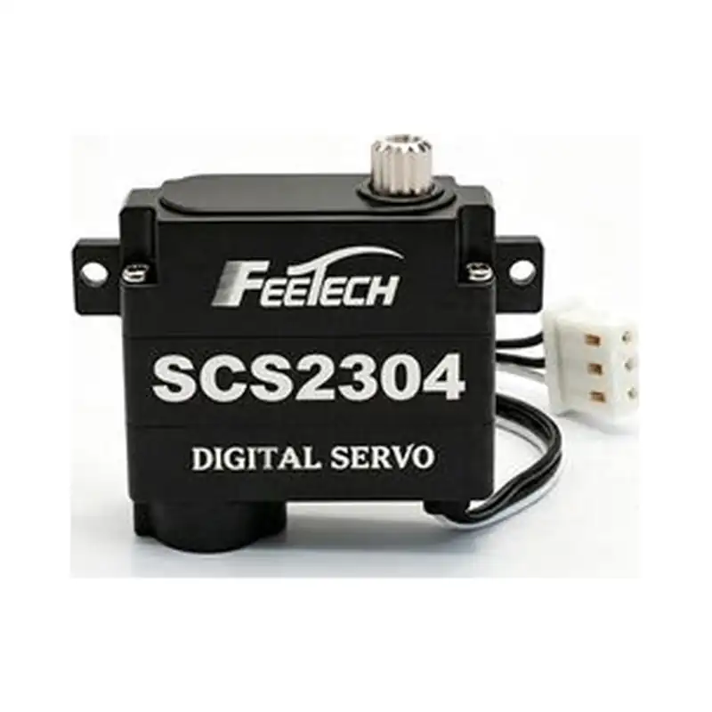
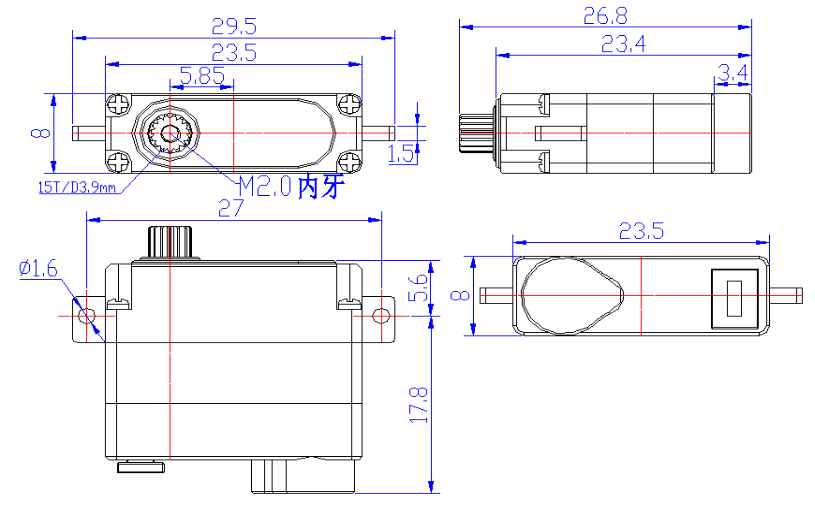

# SC-2304-C001

{ .ft-model-main-image }

Specifications transcribed from the supplied documentation for this exact model and suffix.

[Back to catalog](../../datasheets/sc.md){ .md-button }

## Start your integration

| Your task | Start here | What to check |
| --- | --- | --- |
| Write control software | [Software integration](software.md) | Interface, application layer, read-first bring-up and validation record |
| Design a bracket or joint | [Mechanical integration](mechanical.md) | Drawings, CAD, datum, output shaft and cable clearance |
| Collect engineering files | [Resources and status](#resources) | Available files and outstanding information |

## Key specifications

| Parameter | Specification |
| --- | --- |
| --- | --- |
| Input voltage | 4.8–7.4 V |
| Stall torque | 3.2 kg·cm@6V |
| No-load speed | 0.078 s/60°（129 RPM）@6V |
| Travel / rotation | 270±5°（position value 20～1003） |
| Control interface | TTL |
| Family | SCS |
| Dimensions | 23.5 × 8 × 23.4 mm |
| Weight | 17 ± 1 g |
| Gears | Metal gears（aluminum case） |
| Motor | Coreless motor |
| Communication | TTL half-duplex asynchronous serial，ID 0–253，38400bps ~ 500Kbps |
| Position feedback | Single-turn（protocol position value 0–1023 within 270° travel） |
| Document revision | A/0（Official page captured 2026-10-02） |

- [FEETECH model source](https://www.feetech.cn/580399)

!!! info "Selection note"
    Stall torque is a short-duration limit, not continuous operating torque. Confirm power, shared ground, interface and mechanical clearance before enabling torque.

<!-- official-specs:start -->
## Official model specifications

[FEETECH official product page](https://www.feetechrc.com/580399) · Checked 2026-10-02. The complete model on the page is SC-2304-C001.

| Parameter | Manufacturer specification |
| --- | --- |
| Model | SC-2304-C001 |
| Storage Temperature Range | -20℃～80℃ |
| Operating Temperature Range | -10℃～60℃ |
| Size | A：23.5mm B：8mm C：23.4mm |
| Weight | 17± 1g |
| Gear type | Metal Gear |
| Limit angle | NO limit |
| Bearing | 滚珠轴承 Ball bearings |
| Horn gear spline | 15T/3.9mm |
| Case | Aluminum |
| Connector wire | 15±0.5CM |
| Motor | Coreless Motor |
| Operating Voltage Range | 4.8V-7.4V |
| No load speed | 0.078sec/60°(129RPM)@6V |
| Runnig current(at no load) | ≤80mA@6V |
| Peak stall torque | 3.2kg.cm@6V |
| Stall current | 1.2A@6V |
| Idle Current | 2mA@6V |
| Rated Torgue | 1.05kg.cm@6V |
| Rated Current | 400mA@6V |
| Kt | 2.5kg.cm/A |
| Command signal | Digital Packet |
| Protocol Type | Half duplex Asynchronous Serial Communication |
| ID | 0-253 |
| Neutral Position | 511 |
| Communication Speed | 38400bps ~ 500Kbps |
| Running degree | 270±5°(when 20～1003) |
| Feedback | Load（负载）, Position（位置）,Speed（工作速度）, InputVoltage（输入压）,Temperature（工作温度） |

### Additional facts from the attached datasheet

[Official datasheet](https://www.feetechrc.com/Data/feetechrc/upload/file/20260716/6391980829604735335807667.pdf)

| Parameter | Specification | PDF page |
| --- | --- | --- |
| 角度传感器 Angle Sensor | 类型 Type / Carbon-Film Potentiometer | 4 |
| 齿轮虚位Back Lash | ≦1° | 4 |
| 出力轴螺丝 The rocker screw | M2.0X4 | 4 |
| 信号高电平电压 Signal high Voltage | 2V-5V | 6 |
| 信号低电平电压 Signal Low Voltage | 0.0V-0.45V | 6 |

{ .ft-model-drawing }

[Open full-size drawing](images/drawing.webp)
<!-- official-specs:end -->

<!-- product-resources:start -->
## Resources and document status {#resources}

Local attachments are included in the model package; PDF specifications link to the manufacturer and are not bundled offline. Missing resources are not yet supplied; family guides do not verify model-specific settings.

| Resource | Status / file | Revision |
| --- | --- | --- |
| Model datasheet | [View on manufacturer website (online)](https://www.feetechrc.com/Data/feetechrc/upload/file/20260716/6391980829604735335807667.pdf) | A/0 |
| Connector and pinout | Not supplied | — |
| Model memory table / firmware notes | Not supplied | — |
| 2D mounting drawing | [drawing.webp](images/drawing.webp) | — |
| STEP / 3D model | Not supplied | — |
| Model-tested example | Not supplied | — |
| Raw test data | Not supplied | — |
| Test record and conditions | Not supplied | — |

[Package manifest](manifest.json) · [Request missing resources](#support)

For an offline ZIP with both languages and available attachments, see [product-package export](../../../downloads.md#product-packages).
<!-- product-resources:end -->

## Request resources or report an issue {#support}

Use your existing FEETECH technical-support contact and include the full label/model suffix, firmware version (if known), and the document revision you are using.

- Software: controller/OS, SDK version or commit, adapter/interface, supply voltage, confirmed ID/baud rate (bus models only), minimal reproduction and logs.
- Mechanics: drawing/CAD revision, marked dimensions, required travel, horn/bracket, load and lever arm, duty cycle, and the point of interference.
- Missing files: name the exact item in the resource table (for example, this model's STEP and a dimensioned mounting drawing).

This package currently provides a specification summary and integration checklists. File availability does not imply that your firmware, load case or assembly has been validated.
