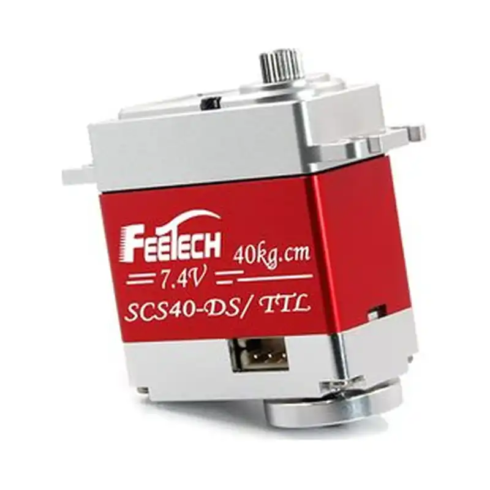
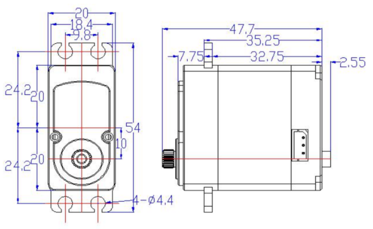

# SC-4000-C003

{ .ft-model-main-image }

Use this page to compare the main specifications of `SC-4000-C003` and plan power, control and mechanical integration.

[Back to SC catalog](../../datasheets/sc.md){ .md-button }

## Start your integration

| Your task | Start here | What to check |
| --- | --- | --- |
| Write control software | [Software integration](software.md) | Interface, application layer, read-first bring-up and validation record |
| Design a bracket or joint | [Mechanical integration](mechanical.md) | Drawings, CAD, datum, output shaft and cable clearance |
| Collect engineering files | [Resources and status](#resources) | Available files and outstanding information |

## Key specifications

| Item | Value |
| --- | --- |
| Input voltage | **8.4 V** |
| Stall torque | **40 kg·cm@8.4V** |
| Control interface | `TTL` |
| Product family | `SCS` |
| Product model | `SCS40-DS` |
| Document revision | `Contact us` |

!!! info "Selection note"
    Stall torque is a short-duration limit for product comparison, not a continuous operating point. Allow suitable margin for duty cycle, temperature, impact, acceleration and mechanism friction.

## Selection and use

1. Confirm the product label and document revision match this page.
2. Confirm the permitted supply range from this model’s formal documentation before selecting a regulated supply; a single catalog voltage does not establish a range. Size current for simultaneous operation.
3. Match the controller, wiring and SDK to the listed interface and product family.
4. Check mounting space, output shaft, travel and mechanical clearance before enabling torque.

For communication commands and software integration, continue with the [SDK guide](../../../sdk/index.md) and the protocol documentation for this product family.

<!-- official-motor:start -->
## Motor classification from the official brochure

Brushed coreless motor. [2024 FEETECH official brochure](https://www.feetechrc.com/Data/feetechrc/upload/file/20240706/2024%E9%A3%9E%E7%89%B9%E5%AE%A3%E4%BC%A0%E5%86%8C.pdf), PDF page 12; matched full model `SC-4000-C003`.
<!-- official-motor:end -->

<!-- official-specs:start -->
## Official model specifications

[FEETECH official product page](https://www.feetechrc.com/84v-40kg-serial-bus-steering-gear) · Checked 2026-10-02. The complete model on the page is SC-4000-C003.

| Parameter | Manufacturer specification |
| --- | --- |
| Model | SC-4000-C003 |
| Storage Temperature Range | -30℃～80℃ |
| Operating Temperature Range | -15℃～70℃ |
| Size | A：40mm B：20mm C：43mm |
| Weight | 78g士0.2 |
| Gear type | Metal Gear |
| Limit angle | No Limiter |
| Bearing | 2 Ball bearings |
| Horn gear spline | 25T |
| Horn type | Aluminium |
| Case | Aluminium |
| Connector wire | 200mm ±5 mm |
| Motor | Coreless motor |
| Operating Voltage Range | 6-8.4V |
| No load speed | 0.12sec/60degree@8.4V 83RPM |
| Runnig current(at no load) | 120 mA@8.4V |
| Peak stall torque | 42.5kg.cm@8.4V |
| Rated torque | 13kg.cm@8.4V |
| Stall current | 1800mA@8.4V |
| Command signal | Bus Packet Communication TTL level |
| Protocol Type | Half duplex Asynchronous Serial Communication |
| ID | 0-253 |
| Communication Speed | 38400bps ~ 1 Mbps |
| Running degree | 300°(when 0～1023)士5° |
| Feedback | Load， Speed， Input Vol tage |
| Position Sensor Resolution | Potentiometer (300° /1024) 士5° |

### Additional facts from the attached datasheet

[Official datasheet](https://www.feetechrc.com/Data/feetechrc/upload/file/20260622/6391771791662132454211154.pdf)

| Parameter | Specification | PDF page |
| --- | --- | --- |
| 位置传感器分辨率 Position Sensor (Resolution) | Potentiometer (300°/1024)±5° | 2 |

{ .ft-model-drawing }

[Open full-size drawing](images/drawing.webp)
<!-- official-specs:end -->

<!-- product-resources:start -->
## Resources and document status {#resources}

Local attachments are included in the model package; PDF specifications link to the manufacturer and are not bundled offline. Missing resources are not yet supplied; family guides do not verify model-specific settings.

| Resource | Status / file | Revision |
| --- | --- | --- |
| Model datasheet | [View on manufacturer website (online)](https://www.feetechrc.com/Data/feetechrc/upload/file/20260622/6391771791662132454211154.pdf) | — |
| Connector and pinout | Not supplied | — |
| Model memory table / firmware notes | Not supplied | — |
| 2D mounting drawing | [drawing.webp](images/drawing.webp) | — |
| STEP / 3D model | Not supplied | — |
| Model-tested example | Not supplied | — |
| Raw test data | Not supplied | — |
| Test record and conditions | Not supplied | — |

[Package manifest](manifest.json) · [Request missing resources](#support)

For an offline ZIP with both languages and available attachments, see [product-package export](../../../downloads.md#product-packages).
<!-- product-resources:end -->

## Request resources or report an issue {#support}

Use your existing FEETECH technical-support contact and include the full label/model suffix, firmware version (if known), and the document revision you are using.

- Software: controller/OS, SDK version or commit, adapter/interface, supply voltage, confirmed ID/baud rate (bus models only), minimal reproduction and logs.
- Mechanics: drawing/CAD revision, marked dimensions, required travel, horn/bracket, load and lever arm, duty cycle, and the point of interference.
- Missing files: name the exact item in the resource table (for example, this model's STEP and a dimensioned mounting drawing).

This package currently provides a specification summary and integration checklists. File availability does not imply that your firmware, load case or assembly has been validated.
