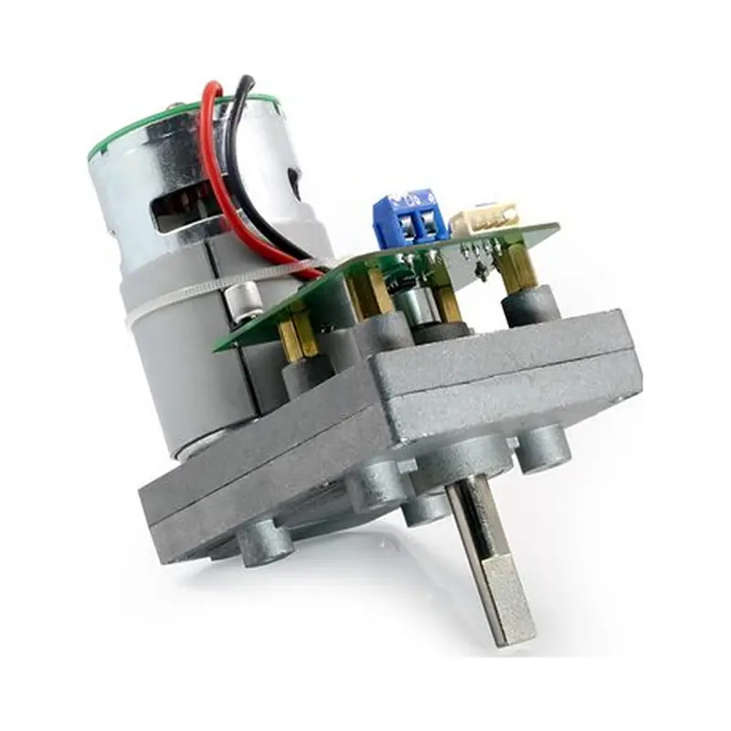
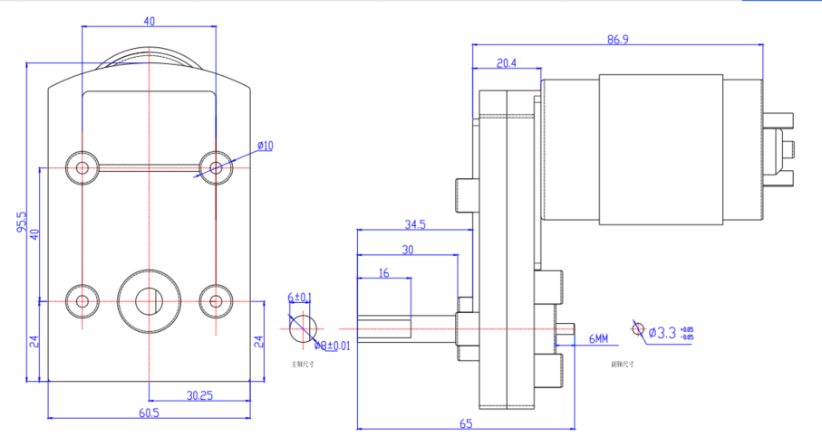

# SM-1500-C001

{ .ft-model-main-image }

Specifications transcribed from the supplied documentation for this exact model and suffix.

[Back to catalog](../../datasheets/sm.md){ .md-button }

## Start your integration

| Your task | Start here | What to check |
| --- | --- | --- |
| Write control software | [Software integration](software.md) | Interface, application layer, read-first bring-up and validation record |
| Design a bracket or joint | [Mechanical integration](mechanical.md) | Drawings, CAD, datum, output shaft and cable clearance |
| Collect engineering files | [Resources and status](#resources) | Available files and outstanding information |

## Key specifications

| Parameter | Specification |
| --- | --- |
| --- | --- |
| Input voltage | 12 V |
| Stall torque | 180 kg·cm@12V |
| No-load speed | 0.67 s/60°（15 RPM） |
| Travel / rotation | 360°（0~4096，magnetic encoder） |
| Control interface | RS-485 |
| Family | SMS |
| Dimensions | 95.5 × 65 × 85 mm |
| Weight | 860 ± 0.2 g |
| Gears | Metal gears |
| Motor | Carbon-brush motor（source label carbon motor） |
| Communication | RS-485 half-duplex asynchronous serial，ID 0–253，38400bps ~ 1Mbps |
| Document revision | A/0（Official page captured 2026-10-02） |

!!! warning "Source inconsistencies"
    The source lists SM-1000-C001 and SM-1500-C001 with the same dimensions, weight and product image, but different torque ratings (120 / 180 kg·cm). The image follows the exact model source.

- [FEETECH model source](https://www.feetech.cn/12v-180kg-485-magnetic-code-serial-bus-steering-gear)

!!! info "Selection note"
    Stall torque is a short-duration limit, not continuous operating torque. Confirm power, shared ground, interface and mechanical clearance before enabling torque.

<!-- official-specs:start -->
## Official model specifications

[FEETECH official product page](https://www.feetechrc.com/12v-180kg-485-magnetic-code-serial-bus-steering-gear) · Checked 2026-10-02. The complete model on the page is SM-1500-C001.

| Parameter | Manufacturer specification |
| --- | --- |
| Model | SM-1500-C001 |
| Storage Temperature Range | -30℃～80℃ |
| Operating Temperature Range | -20℃～70℃ |
| Size | A：95.5mm B：65mm C：85mm |
| Weight | 860g ±0.2 |
| Gear type | Metal Gear |
| Limit angle | 360degree (4096) |
| Bearing | 2 Ball bearings |
| Horn gear spline | D shape dia=8.0mm |
| Case | metal |
| Connector wire | 150mm ±5 mm |
| Motor | carbon motor |
| Operating Voltage Range | 12V |
| Idle current (at stopped) | 15mA |
| No load speed | 0.67sec/ 60degree 15RPM |
| Runnig current(at no load) | 200mA |
| Peak stall torque | 180kg.cm@12V |
| Rated torque | 60@12V |
| Stall current | 4500mA@12V |
| Command signal | Bus Packet Communication RS485 |
| Protocol Type | Half duplex Asynchronous Serial Communication |
| ID | 0-253 |
| Communication Speed | 38400bps ~ 1 Mbps |
| Running degree | 360°(when 0～4096) |
| Feedback | Load,Speed,Input Voltage,Current |
| Position Sensor Resolution | 360° (when 0~4095)-CW |

Attachment checks: Different model PDF: SM150specs.pdf

Other files linked by the manufacturer (model applicability unconfirmed):

- [SM150specs.pdf](https://www.feetechrc.com/Data/feetechrc/upload/file/20201031/6373976297570253257199541.pdf)

{ .ft-model-drawing }

[Open full-size drawing](images/drawing.webp)
<!-- official-specs:end -->

<!-- product-resources:start -->
## Resources and document status {#resources}

Local attachments are included in the model package; PDF specifications link to the manufacturer and are not bundled offline. Missing resources are not yet supplied; family guides do not verify model-specific settings.

| Resource | Status / file | Revision |
| --- | --- | --- |
| Model datasheet | Not supplied | — |
| Connector and pinout | Not supplied | — |
| Model memory table / firmware notes | Not supplied | — |
| 2D mounting drawing | [drawing.webp](images/drawing.webp) | — |
| STEP / 3D model | Not supplied | — |
| Model-tested example | Not supplied | — |
| Raw test data | Not supplied | — |
| Test record and conditions | Not supplied | — |

[Package manifest](manifest.json) · [Request missing resources](#support)

For an offline ZIP with both languages and available attachments, see [product-package export](../../../downloads.md#product-packages).
<!-- product-resources:end -->

## Request resources or report an issue {#support}

Use your existing FEETECH technical-support contact and include the full label/model suffix, firmware version (if known), and the document revision you are using.

- Software: controller/OS, SDK version or commit, adapter/interface, supply voltage, confirmed ID/baud rate (bus models only), minimal reproduction and logs.
- Mechanics: drawing/CAD revision, marked dimensions, required travel, horn/bracket, load and lever arm, duty cycle, and the point of interference.
- Missing files: name the exact item in the resource table (for example, this model's STEP and a dimensioned mounting drawing).

This package currently provides a specification summary and integration checklists. File availability does not imply that your firmware, load case or assembly has been validated.
