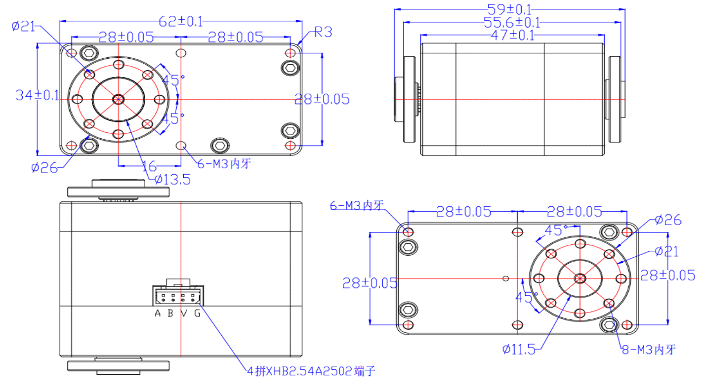

# SM-8524-C002

{ .ft-model-main-image }

Specifications transcribed from the supplied documentation for this exact model and suffix.

[Back to catalog](../../datasheets/sm.md){ .md-button }

## Start your integration

| Your task | Start here | What to check |
| --- | --- | --- |
| Write control software | [Software integration](software.md) | Interface, application layer, read-first bring-up and validation record |
| Design a bracket or joint | [Mechanical integration](mechanical.md) | Drawings, CAD, datum, output shaft and cable clearance |
| Collect engineering files | [Resources and status](#resources) | Available files and outstanding information |

## Key specifications

| Parameter | Specification |
| --- | --- |
| --- | --- |
| Input voltage | 9–24 V |
| Stall torque | 85 kg·cm@24V |
| No-load speed | 0.154 s/60° |
| Travel / rotation | 360°（0~4095） |
| Control interface | RS-485 |
| Family | SMS |
| Dimensions | 62 × 34 × 47 mm |
| Weight | 215 g |
| Gears | Steel gears |
| Motor | Brushless motor |
| Communication | Modbus-RTU（RS-485 physical layer），ID 0–253，38400bps ~ 1Mbps |
| Document revision | A/0（Official page captured 2026-10-02） |

!!! warning "Modbus-RTU model"
    This exact model uses Modbus-RTU over RS-485. Obtain its own register table; SMS_STS addresses, units and control modes do not apply.

- [FEETECH model source](https://www.feetech.cn/24v-85kgcm-modbus-rtu舵机)

!!! info "Selection note"
    Stall torque is a short-duration limit, not continuous operating torque. Confirm power, shared ground, interface and mechanical clearance before enabling torque.

<!-- official-specs:start -->
## Official model specifications

[FEETECH official product page](https://www.feetechrc.com/24v-85kgcm-modbus-rtu舵机) · Checked 2026-10-02. The complete model on the page is SM-8524-C002.

| Parameter | Manufacturer specification |
| --- | --- |
| Model | SM-8524-C002 |
| Storage Temperature Range | -30℃～80℃ |
| Operating Temperature Range | -20℃～70℃ |
| Size | A：62mm B：34mm C：47mm |
| Weight | 215g |
| Gear type | 钢 Steel |
| Limit angle | No limit |
| Bearing | 滚珠轴承 Ball bearings |
| Horn gear spline | 15T/OD7.6mm |
| Horn type | Aluminium |
| Case | Aluminium |
| Connector wire | 40CM |
| Motor | Brushless Motor |
| Operating Voltage Range | 9-24V |
| No load speed | 0.154sec/60degree |
| Runnig current(at no load) | 250mA@24V |
| Peak stall torque | 85kg.cm@24V |
| Rated torque | 28kg.cm@24V |
| Stall current | 5.6A@24V |
| Command signal | Digital Packet |
| Protocol Type | Modbus-RTU |
| ID | 0-253 |
| Communication Speed | 38400bps ~ 1Mbps |
| Running degree | 360° (when 0~ 4095) |
| Feedback | Load（负载）, Position（位 置）,Speed（工作速度）, Input Voltage（输入电压），Current（工作 电流）,Temperature（工作温度） |

Attachment checks: Different model PDF: SM8524BL-C001-串型规格书-20220225.pdf

Other files linked by the manufacturer (model applicability unconfirmed):

- [SM8524BL-C001-串型规格书-20220225.pdf](https://www.feetechrc.com/Data/feetechrc/upload/file/20220318/6378319114593548049307309.pdf)

{ .ft-model-drawing }

[Open full-size drawing](images/drawing.webp)
<!-- official-specs:end -->

<!-- product-resources:start -->
## Resources and document status {#resources}

Local attachments are included in the model package; PDF specifications link to the manufacturer and are not bundled offline. Missing resources are not yet supplied; family guides do not verify model-specific settings.

| Resource | Status / file | Revision |
| --- | --- | --- |
| Model datasheet | Not supplied | — |
| Connector and pinout | Not supplied | — |
| Model memory table / firmware notes | Not supplied | — |
| 2D mounting drawing | [drawing.webp](images/drawing.webp) | — |
| STEP / 3D model | Not supplied | — |
| Model-tested example | Not supplied | — |
| Raw test data | Not supplied | — |
| Test record and conditions | Not supplied | — |

[Package manifest](manifest.json) · [Request missing resources](#support)

For an offline ZIP with both languages and available attachments, see [product-package export](../../../downloads.md#product-packages).
<!-- product-resources:end -->

## Request resources or report an issue {#support}

Use your existing FEETECH technical-support contact and include the full label/model suffix, firmware version (if known), and the document revision you are using.

- Software: controller/OS, SDK version or commit, adapter/interface, supply voltage, confirmed ID/baud rate (bus models only), minimal reproduction and logs.
- Mechanics: drawing/CAD revision, marked dimensions, required travel, horn/bracket, load and lever arm, duty cycle, and the point of interference.
- Missing files: name the exact item in the resource table (for example, this model's STEP and a dimensioned mounting drawing).

This package currently provides a specification summary and integration checklists. File availability does not imply that your firmware, load case or assembly has been validated.
