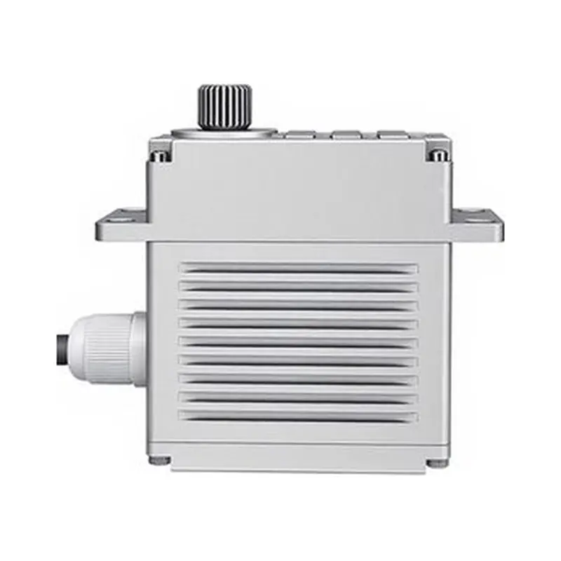
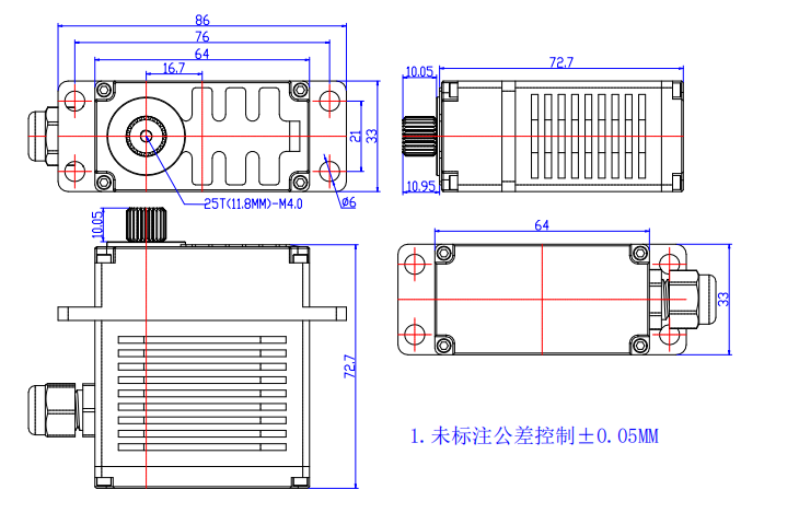

# FT-185B-C001

{ .ft-model-main-image }
`FT-185B-C001` 是官方目录中的12V 185kg.cm PWM 数码 180 度金属钢齿无刷舵机。本页参数转录自飞特官网该型号产品页（2026-10-02 抓取），用于选型对比与集成规划。

[返回 PWM 系列目录](../../datasheets/pwm.md){ .md-button }

## 开始集成

| 我要做什么 | 从这里开始 | 需要确认什么 |
| --- | --- | --- |
| 编写控制程序 | [程序开发](software.md) | 接口、应用层、先读后动的联调步骤与验证记录 |
| 设计支架或关节 | [结构设计](mechanical.md) | 图纸、模型、基准、输出轴及线缆空间 |
| 收集工程文件 | [资料下载与完整性](#resources) | 已提供的附件与待补充资料 |

## 关键参数

| 项目 | 参数 |
| --- | --- |
| 输入电压 | **9–14 V** |
| 堵转扭矩 | **185 kg·cm@12V** |
| 空载速度 | 0.147 s/60°（68 RPM）@12V |
| 行程 / 旋转 | 180°（500~2500 μsec） |
| 控制接口 | `PWM` |
| 产品系列 | `FT` |
| 外形尺寸 | 64 × 33 × 72.7 mm |
| 重量 | 400 ± 5 g |
| 齿轮 | 钢齿轮 |
| 电机 | 无刷电机 |
| 资料版本 | `A/0`（官方页面抓取日期 2026-10-02） |

!!! info "选型提示"
    堵转扭矩是用于产品比较的短时极限值，不是持续工作点。最终设计请结合工作周期、温升、冲击、加速度和机构摩擦保留合适余量。

## 选型与使用

1. 核对实物标签与资料版本是否与本页一致。
2. 供电范围以本页参数表为准；目录电压标注不能自动扩展成电压范围，电流按同时动作工况确认。
3. 控制器、接线方式与控制协议必须匹配本完整型号后，再下发任何指令。
4. 使能扭矩前确认安装空间、输出轴、行程与机械限位。

控制信号与首次调试请继续查看本型号的[程序开发](software.md)；PWM 型号不使用串行总线 SDK。

<!-- official-specs:start -->
## 官网型号详细参数

[飞特官网型号页](https://www.feetechrc.com/586820) · 核对日期：2026-10-02；页面型号：FT-185B-C001。

| 参数 | 官网规格原文（含测试条件） |
| --- | --- |
| 型 号 Model： | FT-185B-C001 |
| 存储温度 Storage Temperature Range | -40℃～80℃ |
| 运行温度 Operating Temperature Range: | -20℃～60℃ |
| 尺寸 Size: | A: 64mm B: 33mm C: 72.7mm |
| 重量 Weight: | 400g±5g |
| 齿轮类型 Gear type: | 钢 Steel |
| 机构极限角度 Limit angle: | NO limit |
| 轴承 Bearing: | 滚珠轴承 Ball bearings |
| 出力轴 Horn gear spline: | 25T/11.8MM |
| 减速比Gear Ratio： | 1/174 |
| 外壳 Case: | Aluminum |
| 舵机线 Connector wire: | 43±1CM |
| 马达 Motor: | Brushless Motor |
| 工作电压Operating Voltage Range: | 9V-14V |
| 静态电流Idle current (atstopped) | 45mA@12V |
| 空载速度 No load speed: | 0.147sec/60°(68RPM)@12V |
| 空载电流 Runnig current(at no load) : | 260mA@12V |
| 堵转扭矩 Peak stall torque: | 185kg.cm@12V |
| 额定扭矩 Rated torque: | 61.6kg.cm@12V |
| 堵转电流 Stall current: | 4600mA@12V |
| 控制信号Command si gnal | Pulse width modulation |
| 控制系统类型 Control System Type | Digital comparator |
| 脉冲宽度范围Pulse width range | 500~2500 μ sec |
| 中立位置Stop position | 1500 μ sec |
| 操作角度Running degree | 180±2°(at 500→2500μsec) |
| 死区宽度Dead band width | ≤4 μ sec |
| 旋转方向Rotating direction | 逆时针 Counterclockwi se (在1500→2500 μ sec) |

### 规格书中的补充参数

[官网规格书](https://www.feetechrc.com/Data/feetechrc/upload/file/20260623/6391782057377931454417588.pdf)

| 参数 | 规格原文 | PDF 页码 |
| --- | --- | --- |
| 角度传感器 Angle Sensor | 类型Type / Carbon-Film Potentiometer | 4 |
| 齿轮虚位Back Lash | ≦0.5° | 4 |
| 出力轴螺丝 The rocker screw | M4X8 | 4 |
| 两边角度差 Left&Right Travelling Angledeviation | ≤ 2° | 4 |
| 回中差 Centering Deviation | ≦1° | 4 |
| 信号周期 Signal Period | 20ms | 7 |
| 信号高电平电压 Signal high Voltage | 2V-5V | 7 |
| 信号低电平电压 Signal Low Voltage | 0.0V-0.45V | 7 |

{ .ft-model-drawing }

[查看原尺寸图纸](images/drawing.webp)
<!-- official-specs:end -->

<!-- product-resources:start -->
## 资料下载与完整性 {#resources}

本地附件已收录在型号资料包中；PDF 规格书通过官网链接查看，不包含在离线包中。“待补充”表示尚未提供，系列教程不能代替型号专用参数确认。

| 资料 | 状态 / 文件 | 版本 |
| --- | --- | --- |
| 型号规格书 | [官网查看（需联网）](https://www.feetechrc.com/Data/feetechrc/upload/file/20260623/6391782057377931454417588.pdf) | A/0 |
| 接口与针序图 | 待补充 | — |
| 型号内存表 / 固件说明 | 不适用 | — |
| 2D 安装图 | [drawing.webp](images/drawing.webp) | — |
| STEP / 3D 模型 | 待补充 | — |
| 型号验证示例 | 待补充 | — |
| 原始测试数据 | 待补充 | — |
| 测试记录与条件说明 | 待补充 | — |

[下载资料清单](manifest.json) · [申请缺失资料](#support)

需要包含中英文说明和已收录附件的离线 ZIP，参见[型号资料包导出](../../../downloads.md#product-packages)。
<!-- product-resources:end -->
## 申请资料与反馈问题 {#support}

向已有的飞特技术支持联系人提供完整标签型号及后缀、固件版本（如已知）和正在使用的资料版本。

- 程序问题：主控与系统、SDK 版本或提交号、适配器与接口、供电电压、已确认的 ID / 波特率（仅总线型号）、最小复现步骤及日志。
- 结构问题：图纸 / 模型版本、标注尺寸、所需行程、舵盘 / 支架、负载与力臂、工作周期及干涉位置。
- 缺少资料：直接说明资料表中的具体项目，例如“本型号 STEP 和带公差的安装图”。

本资料包当前提供规格摘要和集成检查步骤；文件可下载不代表已验证你的固件、负载工况或装配方案。
