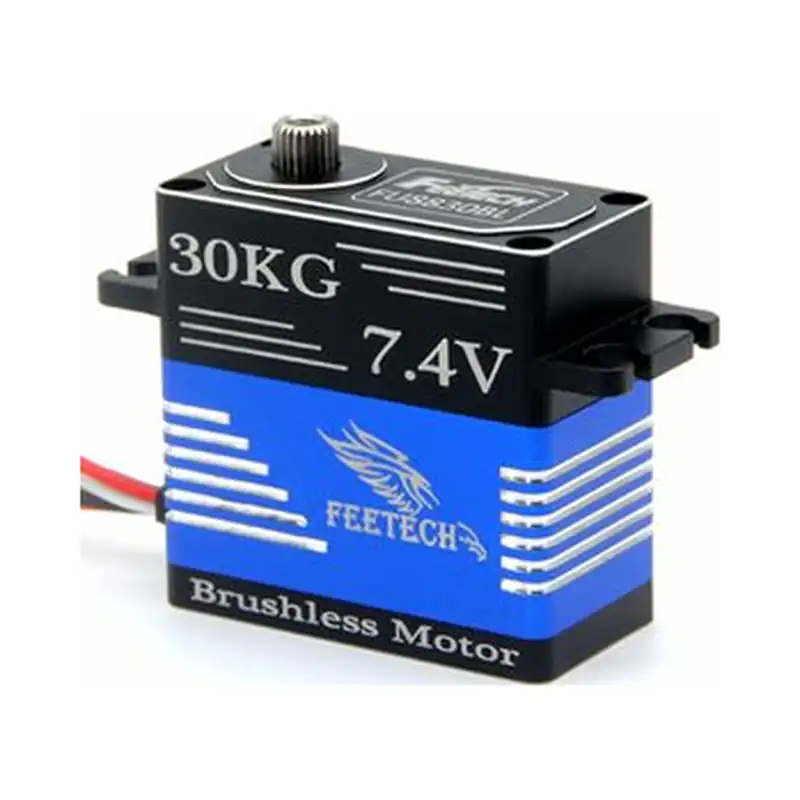

# FU-8830-C001

{ .ft-model-main-image }
`FU-8830-C001` 是 FU88 系列面向 CAN 总线组网的 180° 无刷舵机，采用无刷电机、钛齿金属壳和磁编码反馈，防护等级 IP66，适用于需要总线组网、较长线束与较高防护等级的机器人关节和执行机构。

[返回 FU 系列目录](../../datasheets/fu.md){ .md-button }
[产品选型器](../../index.md){ .md-button }

## 开始集成

| 我要做什么 | 从这里开始 | 需要确认什么 |
| --- | --- | --- |
| 编写控制程序 | [程序开发](software.md) | 接口、应用层、先读后动的联调步骤与验证记录 |
| 设计支架或关节 | [结构设计](mechanical.md) | 图纸、模型、基准、输出轴及线缆空间 |
| 收集工程文件 | [资料下载与完整性](#resources) | 已提供的附件与待补充资料 |

## 关键参数

| 项目 | 参数 |
| --- | --- |
| 输入电压 | **6–8.4 V** |
| 堵转扭矩 | **34.5 kg·cm@7.4V** |
| 额定扭矩 | **11.5 kg·cm@7.4V** |
| 空载速度 | **0.083 s/60°（120 RPM）@7.4V** |
| 控制接口 | `CAN 总线（UAVCAN）` |
| 操作角度 | 180 ± 5°（500→2500 μs） |
| 中位脉宽 | 1500 μs |
| 死区 | ≤ 4 μs |
| 旋转方向 | 逆时针（1500→2000 μs） |
| 机内限位 | 无 |
| 电机 | 无刷电机 |
| 齿轮 | 钛齿，减速比 1/241 |
| 输出轴 | 25T / 5.9 mm |
| 外壳 | 铝合金 |
| 外形尺寸 | 40 × 20 × 39 mm |
| 重量 | 86.4 ± 2 g |
| 静态电流 | 55 mA @7.4V |
| 空载电流 | 420 mA @7.4V |
| 防护等级 | IP66 |
| 工作温度 | -20 ~ 60 ℃ |
| 存储温度 | -30 ~ 80 ℃ |

!!! info "选型提示"
    堵转扭矩是短时极限值，不是持续工作点。CAN 组网时应按同时动作的峰值电流、线束压降、工作周期和温升保留余量；本型号**没有机械限位**，行程必须由上位控制和机构共同限制。

## 适用场景

- 需要 CAN 总线组网与集中布线的多关节机器人
- 户外、粉尘或溅水环境（IP66）下的执行机构
- 需要较大堵转扭矩和 180° 行程的关节
- 无刷驱动、要求低齿隙传动的连续往复机构
- 线束较长、电气噪声较大的移动平台或车载设备

## 集成要点

1. 使用 6–8.4 V 电源；2S 锂电池满电即为 8.4 V，不得继续升高。多轴同时动作时按堵转电流（约 4.8 A/台）预留电源容量与线束截面。
2. 本型号是 CAN 总线（UAVCAN 协议）产品，需要 CAN 收发器或支持 CAN 的调试板；半双工 TTL 调试板和普通 PWM 测试器不能直接替代。参见[调试板与适配器](../../../tools/adapters.md)。
3. 接线前确认终端电阻、总线拓扑、节点地址与波特率，并保证控制器、适配器、舵机与电源按规范共地。
4. 本型号无机械限位，务必先确认 500→2500 μs 有效脉宽与 180° 行程对应的控制限位，再做全行程动作。
5. 先空载低速小幅验证方向与零位，确认后再连接机构。节点地址、控制模式与单位以本型号正式 CAN / UAVCAN 资料及固件版本为准，不要套用其他系列的内存表。

!!! note "参数与资料来源"
    本页参数取自飞特官方产品页（[feetech.cn](https://www.feetech.cn/en/503338.html)）及其公布的规格书 `FU-8830-C001规格书-20241017.pdf`。规格书、针序图、外形图与 STEP 模型尚未收录进本资料包，详见下方资料清单。

<!-- official-specs:start -->
## 官网型号详细参数

[飞特官网型号页](https://www.feetechrc.com/503338) · 核对日期：2026-10-02；页面型号：FU-8830-C001。

| 参数 | 官网规格原文（含测试条件） |
| --- | --- |
| 型 号 Model： | FU-8830-C001 |
| 存储温度 Storage Temperature Range | -30℃～80℃ |
| 运行温度 Operating Temperature Range: | -20℃～60℃ |
| 尺寸 Size: | A：40mm B：20mm C: 39mm |
| 重量 Weight: | 86.4±2g |
| 齿轮类型 Gear type: | 钛齿 Titanium |
| 机构极限角度 Limit angle: | NO |
| 轴承 Bearing: | 滚珠轴承 Ball bearings |
| 出力轴 Horn gear spline: | 25T/5.9mm |
| 减速比Gear Ratio： | 1/241 |
| 外壳 Case: | Aluminum |
| 舵机线 Connector wire: | 30±1CM |
| 马达 Motor: | Brushless Motor |
| 工作电压Operating Voltage Range: | 6-8.4V |
| 静态电流Idle current (atstopped) | 55mA@7.4V |
| 空载速度 No load speed: | 0.083sec/60°(120RPM)@7.4V |
| 空载电流 Runnig current(at no load) : | 420mA@7.4V |
| 堵转扭矩 Peak stall torque: | 34.5kg.cm@7.4V |
| 额定扭矩 Rated torque: | 11.5kg.cm@7.4V |
| 控制信号Command signal | Pulse width modulation |
| 通讯协议 Communication Protocol | UAVCAN |
| 控制系统类型 Control System Type | Digital comparator |
| 脉冲宽度范围Pulse width range | 500~2500 μ sec |
| 中立位置Stop position | 1500 μ sec |
| 操作角度Running degree | 180±5°(at 500→2500μsec) |
| 死区宽度Dead band width | ≤4 μ sec |
| 旋转方向Rotating direction | 逆时针 Counterclockwise(在1500→2000 μsec) |
| 防水性能Waterproof performance： | IP66 |

附件核对（未纳入资料包）：PDF content model not verified: FU-8830-C001规格书-20241017.pdf

官网其它关联附件（适用型号尚未核实）：

- [FU-8830-C001规格书-20241017.pdf](https://www.feetechrc.com/Data/feetechrc/upload/file/20260617/6391731564544371956530548.pdf)

{ .ft-model-drawing }

[查看原尺寸图纸](images/drawing.webp)
<!-- official-specs:end -->

<!-- product-resources:start -->
## 资料下载与完整性 {#resources}

本地附件已收录在型号资料包中；PDF 规格书通过官网链接查看，不包含在离线包中。“待补充”表示尚未提供，系列教程不能代替型号专用参数确认。

| 资料 | 状态 / 文件 | 版本 |
| --- | --- | --- |
| 型号规格书 | 待补充 | — |
| 接口与针序图 | 待补充 | — |
| 型号内存表 / 固件说明 | 待补充 | — |
| 2D 安装图 | [drawing.webp](images/drawing.webp) | — |
| STEP / 3D 模型 | 待补充 | — |
| 型号验证示例 | 待补充 | — |
| 原始测试数据 | 待补充 | — |
| 测试记录与条件说明 | 待补充 | — |

[下载资料清单](manifest.json) · [申请缺失资料](#support)

需要包含中英文说明和已收录附件的离线 ZIP，参见[型号资料包导出](../../../downloads.md#product-packages)。
<!-- product-resources:end -->

## 申请资料与反馈问题 {#support}

向已有的飞特技术支持联系人提供完整标签型号及后缀、固件版本（如已知）和正在使用的资料版本。

- 程序问题：主控与系统、SDK 版本或提交号、适配器与接口、供电电压、已确认的 ID / 波特率（仅总线型号）、最小复现步骤及日志。
- 结构问题：图纸 / 模型版本、标注尺寸、所需行程、舵盘 / 支架、负载与力臂、工作周期及干涉位置。
- 缺少资料：直接说明资料表中的具体项目，例如“本型号 STEP 和带公差的安装图”。

本资料包当前提供规格摘要和集成检查步骤；文件可下载不代表已验证你的固件、负载工况或装配方案。
