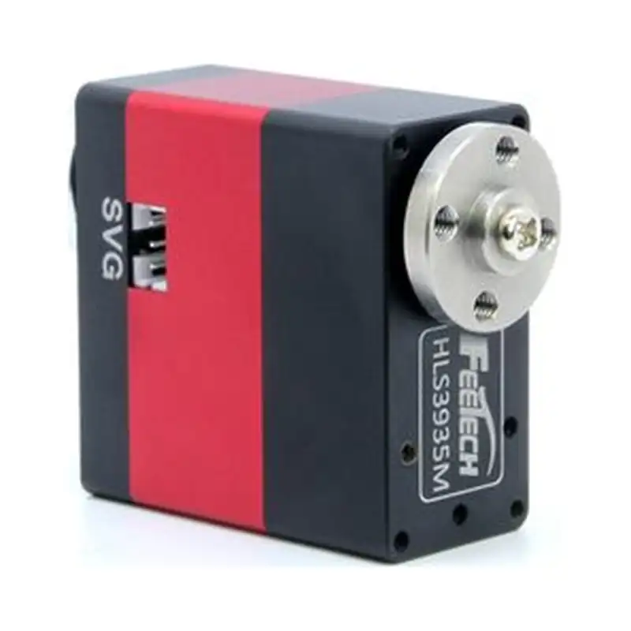
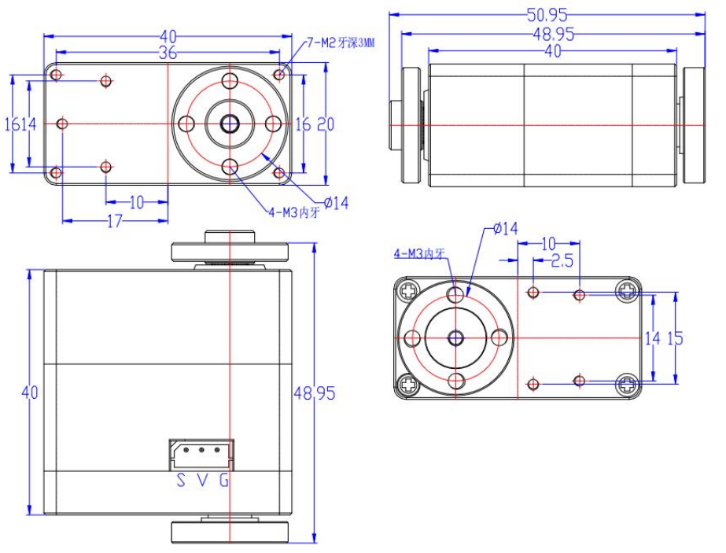

# HL-3935-C001

{ .ft-model-main-image }

本页提供 `HL-3935-C001` 的主要产品规格，便于完成供电、控制与机械集成选型。

[返回 HL 系列目录](../../datasheets/hl.md){ .md-button }

## 开始集成

| 我要做什么 | 从这里开始 | 需要确认什么 |
| --- | --- | --- |
| 编写控制程序 | [程序开发](software.md) | 接口、应用层、先读后动的联调步骤与验证记录 |
| 设计支架或关节 | [结构设计](mechanical.md) | 图纸、模型、基准、输出轴及线缆空间 |
| 收集工程文件 | [资料下载与完整性](#resources) | 已提供的附件与待补充资料 |

## 关键参数

| 项目 | 参数 |
| --- | --- |
| 输入电压 | **9V-12.6V** |
| 堵转扭矩 | **35kg·cm@12V** |
| 控制接口 | `TTL` |
| 产品系列 | `HLS` |
| 产品型号 | `HLS3935M-C001` |
| 资料版本 | `A/0` |

!!! info "选型提示"
    堵转扭矩是用于产品比较的短时极限值，不是持续工作点。最终设计请结合工作周期、温升、冲击、加速度和机构摩擦保留合适余量。

## 选型与使用

1. 核对实物标签与资料版本是否与本页一致。
2. 先从本型号正式资料确认允许输入范围，再选择稳压电源；目录中的单一电压值不能自动扩展成电压范围。电流按同时动作工况确认。
3. 控制器、接线方式和 SDK 必须匹配本页列出的接口与产品系列。
4. 使能扭矩前确认安装空间、输出轴、行程与机械限位。

通信指令和软件集成方法请继续查看 [SDK 指南](../../../sdk/index.md)以及对应产品系列的协议资料。

<!-- official-specs:start -->
## 官网型号详细参数

[飞特官网型号页](https://www.feetechrc.com/531930) · 核对日期：2026-10-02；页面型号：HL-3935-C001。

| 参数 | 官网规格原文（含测试条件） |
| --- | --- |
| 型 号 Model： | HL-3935-C001 |
| 存储温度 Storage Temperature Range | -30℃～80℃ |
| 运行温度 Operating Temperature Range: | -20℃～60℃ |
| 温度 Temperature Range: | 25℃ ±5℃ |
| 湿度 Humidity Range: | 65%±10% |
| 尺寸 Size: | A：40mm B：20mm C：40mm |
| 重量 Weight: | 85± 1g |
| 齿轮类型 Gear type: | 钢steel |
| 机构极限角度 Limit angle: | No limit |
| 轴承 Bearing: | 滚珠轴承 Ball bearings |
| 出力轴 Horn gear spline: | 25T/OD5.9mm |
| 减速比Gear Ratio： | 1/378 |
| 外壳 Case: | Aluminium |
| 舵机线 Connector wire: | 15CM |
| 马达 Motor: | Coreless Motor |
| 额定工作电压 Rated Input Voltage： | 9V-12.6V |
| 空载速度 No load speed: | 0.117sec/60°( 85RPM )@12V |
| 空载电流 Runnig current(at no load) : | 200mA@12V |
| 堵转扭矩 Peak stall torque: | 35kg.cm@12V |
| 堵转电流 Stall current: | 3.1A@12V |
| 额定负载Rated Load： | 8.5kg. cm@12V |
| 额定电流Rated current： | 800mA@12V |
| KT常数 | 11.5kg. cm/A |
| 电机内阻Terminal resistance： | 1.75 Ω |
| 运行模式 Operating Modes： | 模式0：角度伺服模式 （默认此模式，0-360度[敏感词]位置可控） Mode 0: Angle servo mode (default mode, absolute position controllable from 0-360 degrees) |
| 恒力输出 Constant force output： | 设定输出扭矩值，舵机可保持该扭矩(44号地址输入相对应的目标扭矩值，舵机可保持该扭矩) Set the output torque value, the servo can maintain this torque (input the target torque value corresponding to address 44, the servo can maintain this torque) |
| 多圈模式 Multi-Loop Mode： | [敏感词]精度下可以正负7圈[敏感词]位置控制，但掉电圈数不保存（扩大分辨率，圈数可翻倍） control of positive and negative 7 turns at the highest accuracy, but the umber of power failure turns is not saved (the resolution can be expanded, and the number of turns can be doubled) |
| 控制信号 Command signal: | Digital Packet |
| 协议类型 Protocol Type: | Half Duplex Asynchronous Serial Communication |
| ID范围 ID range: | 0-253(默认出厂值为“ID1”） |
| 通读速率 Communication Speed: | 38400bps ~ 1 Mbps（默认出厂波特率为1000000） |
| 控制算法 Control Algorithm： | PID（可自定义） |
| 中位 Neutral Position： | 180°（2048） |
| 旋转角度 Running degree: | 360° (when 0~4096) |
| 电子分辨率 Resolution [deg/pulse] | 0.088°(360°/4096) |
| 旋转方向 Rotating Direction： | Clockwise(0→4096） |
| 反馈 Feedback: | Load（负载）, Position（位置）,Speed（工作速度）, Input Voltage（输入电压），Current（工作电流）,Temperature（工作温度） |

### 规格书中的补充参数

[官网规格书](https://www.feetechrc.com/Data/feetechrc/upload/file/20260623/6391782919616948101472459.pdf)

| 参数 | 规格原文 | PDF 页码 |
| --- | --- | --- |
| 角度传感器 Angle Sansor | 类型Type / 12Bits Magnetic Coding | 5 |
| 齿轮虚位Back Lash | ≦0.5° | 5 |
| 摇臂虚位 The rocker phantom | 0° | 5 |
| 出力轴螺丝 The rocker screw | M3X6 | 5 |
| 信号高电平电压 Signal high Voltage | 2V-5V | 9 |
| 信号低电平电压 Signal Low Voltage | 0.0V-0.45V | 9 |

{ .ft-model-drawing }

[查看原尺寸图纸](images/drawing.webp)
<!-- official-specs:end -->

<!-- product-resources:start -->
## 资料下载与完整性 {#resources}

本地附件已收录在型号资料包中；PDF 规格书通过官网链接查看，不包含在离线包中。“待补充”表示尚未提供，系列教程不能代替型号专用参数确认。

| 资料 | 状态 / 文件 | 版本 |
| --- | --- | --- |
| 型号规格书 | [官网查看（需联网）](https://www.feetechrc.com/Data/feetechrc/upload/file/20260623/6391782919616948101472459.pdf) | A/0 |
| 接口与针序图 | 待补充 | — |
| 型号内存表 / 固件说明 | 待补充 | — |
| 2D 安装图 | [drawing.webp](images/drawing.webp) | — |
| STEP / 3D 模型 | 待补充 | — |
| 型号验证示例 | 待补充 | — |
| 原始测试数据 | 待补充 | — |
| 测试记录与条件说明 | 待补充 | — |

[下载资料清单](manifest.json) · [申请缺失资料](#support)

需要包含中英文说明和已收录附件的离线 ZIP，参见[型号资料包导出](../../../downloads.md#product-packages)。
<!-- product-resources:end -->

## 申请资料与反馈问题 {#support}

向已有的飞特技术支持联系人提供完整标签型号及后缀、固件版本（如已知）和正在使用的资料版本。

- 程序问题：主控与系统、SDK 版本或提交号、适配器与接口、供电电压、已确认的 ID / 波特率（仅总线型号）、最小复现步骤及日志。
- 结构问题：图纸 / 模型版本、标注尺寸、所需行程、舵盘 / 支架、负载与力臂、工作周期及干涉位置。
- 缺少资料：直接说明资料表中的具体项目，例如“本型号 STEP 和带公差的安装图”。

本资料包当前提供规格摘要和集成检查步骤；文件可下载不代表已验证你的固件、负载工况或装配方案。
