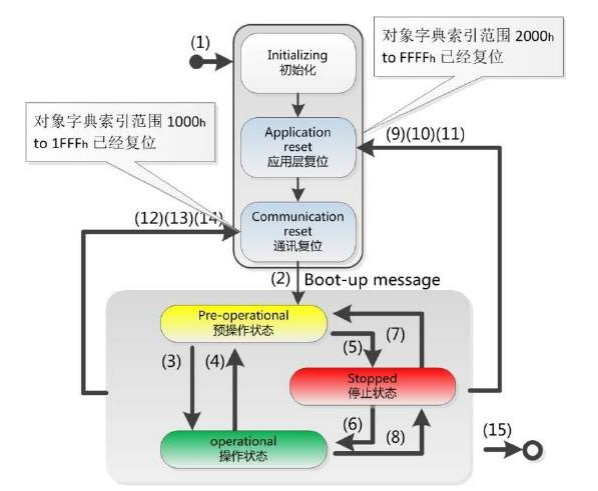
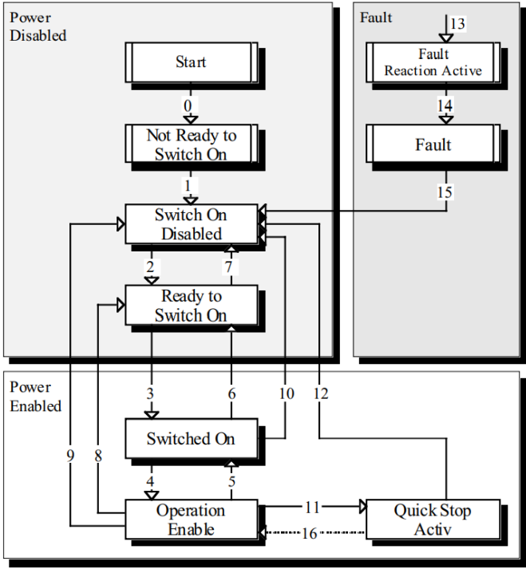

# 舵机CANOPEN完整通信协议

本文为官方《舵机CANOPEN完整通信协议》文档的转录。SHC 系列内存表（CANopen 对象字典）见 [SHC 内存表](../parameter/memory-shc.md)。

## 1 CANOPEN网络通信

CANopen是一个基于CAN总线的网络传输应用层协议，遵循主从通信架构。主从节点通过过程数据对象(PDO)、服务数据对象(SDO)进行字典内容数据的读写以及其他信息的交互。CIA301(DS301)协议标准定义了CANopen基本的通信框架，CIA402(DS402)定义了驱动器和运动控制的具体实现和标准，通过这套标准的规范和定义，不同厂家的运动设备和控制设备更加容易结合使用。

## 2 CIA301

### 2.1 通信标识符

CANopen将CAN2.0A的11位ID 重新定义为COB-ID=功能代码（高四位）+ 节点地址（低7位）

**COB-ID组成格式**

| 10bit ~ 7bit | 6bit ~ 0bit |
| --- | --- |
| 功能码 | NodeID |

**COB-ID 分配表**

| 通信对象 | 功能代码 | 节点地址 | COB-ID |
| --- | --- | --- | --- |
| NTM | 0000b | 0 | 0h |
| SYNC | 0001b | 0 | 80h |
| EMCY | 0001b | 1 - 127 | 80h+NodeID |
| TPDO1 | 0011b | 1 - 127 | 180h+NodeID |
| TPDO2 | 0101b | 1 - 127 | 280h+NodeID |
| TPDO3 | 0111b | 1 - 127 | 380h+NodeID |
| TPDO4 | 1001b | 1 - 127 | 480h+NodeID |
| RPDO1 | 0100b | 1 - 127 | 200h+NodeID |
| RPDO2 | 0110b | 1 - 127 | 300h+NodeID |
| RPDO3 | 1000b | 1 - 127 | 400h+NodeID |
| RPDO4 | 1010b | 1 - 127 | 500h+NodeID |
| TSDO | 1011b | 1 - 127 | 580h+NodeID |
| RSDO | 1100b | 1 - 127 | 600h+NodeID |
| 心跳 | 1110b | 1 - 127 | 700h+NodeID |
| boot up | 1110b | 1 - 127 | 700h+NodeID |

### 2.2 网络管理 NMT

网络管理系统(NMT)用于初始化、启动、停止网络中的节点，遵循主从架构且只能有一个NMT主机。

NMT命令如下:

| NMT 命令代码 | 描述 | 允许的通信对象 |
| --- | --- | --- |
| 0x01 | 节点状态变更为操作状态 | SDO、NMT、EMCY、心跳 |
| 0x02 | 节点状态变更为停止状态 | EMCY、NMT、心跳 |
| 0x80 | 节点状态变更为预操作状态 | SDO、PDO、NMT、SYNC、EMCY、心跳 |
| 0x81 | 复位节点 | 节点重启后进入 初始化状态(Initialization) |
| 0x82 | 复位通信 | 仅通信参数复位，节点进入初始化状态 |

NMT状态码如下:

| NMT 状态代码 | 描述 |
| --- | --- |
| 0x00 | 启动(boot up)状态 |
| 0x04 | 停止状态 |
| 0x05 | 操作状态 |
| 0x7f | 预操作状态 |

NMT报文

| COB-ID | 字节0 | 字节1 |
| --- | --- | --- |
| 000h | NMT命令 | NodeID |

**备注：NodeID范围1～127，0表示广播指令**

### 2.3 服务数据对象 SDO

SDO主要用于CANopen 主站对从节点的参数配置。服务确认是SDO的最大的特点，为每个消息都生成一个应答，确保数据传输的准确性。在一个 CANopen 系统中，通常CANopen 从节点作为 SDO 服务器，CANopen 主节点 作为客户端（称为 CS 通讯）。SDO客户端通过索引和子索引，能够访问 SDO 服务器上的对象字典。这样CANopen主节点可以访问从节点的任意对象字典项的参数，并且 SDO也可以传输任何长度的数据（当数据长度超过4个字节时就拆分成多个报文来传输）。

**SDO写操作格式**

| 操作 | COB-ID | 字节0 | 字节1字节2 | 字节3 | 字节4 ~ 字节7 |
| --- | --- | --- | --- | --- | --- |
| 发送 | 600h+NodeID | 23h | 主索引 | 子索引 | 数据（4字节） |
| 发送 | 600h+NodeID | 27h | 主索引 | 子索引 | 数据（3字节） |
| 发送 | 600h+NodeID | 2Bh | 主索引 | 子索引 | 数据（2字节） |
| 发送 | 600h+NodeID | 2Fh | 主索引 | 子索引 | 数据（1字节） |
| 返回 | 580h+NodeID | 60h | 主索引 | 子索引 | 补0 |
| 返回 | 580h+NodeID | 80h | 主索引 | 子索引 | 中止代码 |

**SDO读操作格式**

| 操作 | COB-ID | 字节0 | 字节1字节2 | 字节3 | 字节4 ~ 字节7 |
| --- | --- | --- | --- | --- | --- |
| 发送 | 600h+NodeID | 40h | 主索引 | 子索引 | 补0 |
| 返回 | 580h+NodeID | 43h | 主索引 | 子索引 | 数据（4字节） |
| 返回 | 580h+NodeID | 47h | 主索引 | 子索引 | 数据（3字节） |
| 返回 | 580h+NodeID | 4Bh | 主索引 | 子索引 | 数据（2字节） |
| 返回 | 580h+NodeID | 4Fh | 主索引 | 子索引 | 数据（1字节） |
| 返回 | 580h+NodeID | 80h | 主索引 | 子索引 | 中止代码 |

**SDO中止代码**

| 中止代码 | 描述 |
| --- | --- |
| 05 04 00 01 | 非法或未知的SDO命令字 |
| 06 01 00 01 | 试图读只写对象 |
| 06 01 00 02 | 试图写只读对象 |
| 06 02 00 00 | 对象字典中对象不存在 |
| 06 04 00 41 | 对象不能够映射到PDO |
| 06 07 00 12 | 数据类型不匹配 |
| 06 09 00 11 | 子索引不存在 |
| 06 09 00 30 | 超出参数的值范围 |
| 08 00 00 24 | 无可用数据 |

### 2.4 过程数据对象 PDO

PDO属于过程数据用来单向传输实时数据，无需接收节点回应 CAN 报文来确认，遵循生产消费者模型。PDO按照从机节点的角度，可分为RPDO和TPDO，由通信参数和映射参数共同决定最终的传输方式。

**RPDO/TPDO映射对象地址定义:**

| bit31 ~ bit16 | bit15 ~ bit8 | bit7 ~ bit0 |
| --- | --- | --- |
| 索引 | 子索引 | 位数长度 |

**PDO对象列表:**

| 名称 | COB-ID | 通信对象 | 映射对象 |
| --- | --- | --- | --- |
| RPDO1 | 200h+NodeID | 1400h | 1600h |
| RPDO2 | 300h+NodeID | 1401h | 1601h |
| RPDO3 | 400h+NodeID | 1402h | 1602h |
| RPDO4 | 500h+NodeID | 1403h | 1603h |
| TPDO1 | 180h+NodeID | 1800h | 1A00h |
| TPDO2 | 280h+NodeID | 1801h | 1A01h |
| TPDO3 | 380h+NodeID | 1802h | 1A02h |
| TPDO4 | 480h+NodeID | 1803h | 1A03h |

PDO通信参数：PDO相关的COB-ID、状态位、传输类型、禁止时间和时间计时器均可通过对应的通信对象字典进行配置。
PDO映射参数：可通过配置PDO对应的映射对象字典，设置PDO实际对应的数据内容。

### 2.5 同步对象 SYNC

同步对象是用于控制同一网络中多个节点发送与接收之间同步一致的特殊机制，多用于PDO的同步传输。可以通过以下字典：1006h（循环同步周期）、1007（同步窗口时间）、1005h（同步对象）进行配置。

| COB-ID | 数据 |
| --- | --- |
| 80h | 无 |

### 2.6 紧急对象服务 EMCY

紧急事件对象(Emergency)，是当设备内部发生错误，触发该对象，发送设备内部错误代码，提示NMT主站。紧急报文属于诊断性报文，一般不会影响CANopen通讯，其CAN-ID存储在1014h的索引中，一般会定义为080h+NodeID，数据包含8个字节。

**当节点出现故障时，需要更新错误寄存器和预定义错误场。紧急报文内容按以下规范:**

| COB-ID | 字节0 字节1 | 字节2 | 字节3 | 字节4 ~ 字节7 |
| --- | --- | --- | --- | --- |
| 80h+NodeID | 错误码 | 错误寄存器 | 保留 | 辅助字节 |

错误码：为对象字典预定义错误场(1003h)中最新一次数值，详细定义参考对象字典说明
错误寄存器：为对象字典错误寄存器(1001h)中的数值，详细定义参考对象字典说明
辅助字节：为厂商自定义数值

### 2.7 特殊报文

#### 2.7.1 boot up报文

上电第一个报文

| COB-ID | 字节0 |
| --- | --- |
| 700h+NodeID | 00h |

#### 2.7.2 心跳报文

置参数周期设置：通过对象字典索引0x1017配置心跳周期（单位ms）。设为0时关闭心跳功能
超时机制：主节点为每个从节点设定超时阈值，若超时未收到心跳则判定节点离线并触发错误

| COB-ID | 字节0 |
| --- | --- |
| 700h+NodeID | 操作状态 |

## 3 CIA402

### 3.1 状态机

### 3.2 控制字

| BIT | 内容 | 描述 | 说明 |
| --- | --- | --- | --- |
| 0 | so | Switch on启动 | 1有效 |
| 1 | ev | Enable voltage 电压使能 | 固定1 |
| 2 | qs | quick stop 快速停机 | 0有效 |
| 3 | eo | Enable operation 运行使能 | 1有效 |
| 4 ~ 6 | oms | Operation mode specific 操作模式特殊定义位 |  |
| 7 | fr | Fault reset 故障复位 | 1有效 |
| 8 | h | Halt 暂停 |  |
| 9 | h | Operation mode specific 操作模式特殊定义位 |  |
| 10 | r | 保留 |  |
| 15 ~ 11 | r | 厂家定义 |  |

### 3.3 状态字

| BIT | 名称 | 描述 | 说明 |
| --- | --- | --- | --- |
| 0 | rtso | 准备 | 固定1 |
| 1 | so | 启动 | 固定1 |
| 2 | oe | 运行使能 | 1有效 |
| 3 | f | 故障 | 1有效 |
| 4 | ve | 电压使能 | 固定1 |
| 5 | qs | 快速停机 | 0有效 |
| 6 | sod | swd | 固定1 |
| 7 | w | 警告 | 1有效 |
| 8 | ms | 厂家定义 |  |
| 9 | rm | 远程 | 固定1 |
| 10 | tr | 目标到达 |  |
| 11 | ite | 限制 |  |
| 12 13 | oms | 特殊定义 |  |
| 13 14 | ms | 厂家定义 |  |
